# 因特网的概述

* 网络、互连网(互联网)和因特网
* 因特网发展的三个阶段
* 因特网的标准化工作
* 因特网的组成

## 网络、互连网(互联网)和因特网

1. 网络：网络是由若干**结点**(Node)和连接这些结点的**链路**组成。

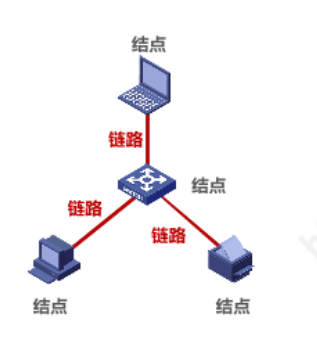
2. 互连网(互联网): 多个网络通过路由器互连起来所构成的一个覆盖范围更大的网络。互联网是**网络的网络**。

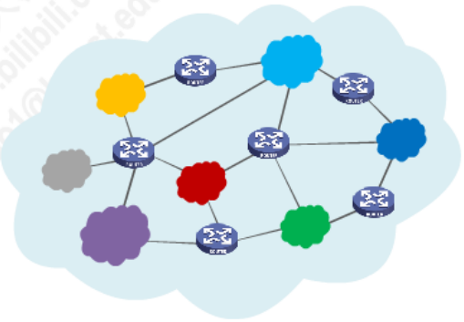
3. 因特网: 因特网是**世界上最大**的互连网络，即:**Internet**。
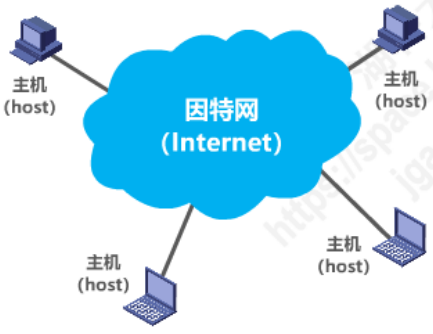

> **网络把许多计算机连接在一起，而互连网则把许多网络通过一些路由器连接在一起。与网络相连的计算机常称为主机。**

- - -

## 互联网基础结构发展的三个阶段

&emsp;&emsp;互联网的基础结构大体上经历了三个阶段的演进。

* 第一个阶段: 从**单个网络ARPANET**向**互连网**发展的过程。
* 第二个阶段: 逐步建成了**三级结构的互联网**。
* 第三个阶段: 逐渐形成了**全球范围的多层次ISP结构的互联网。**

### 第一个阶段：从单个网络ARPANET向互连网发展的过程

&emsp;&emsp;1969年美国国防部创建的第一个分组交换网络ARPANET最初只是一个单个的分组交换网(并不是一个互连的网络)。后来人们认识到不可能仅使用一个单独的网络来满足所有的通信需求。于是美国国防部高级研究计划局(ARPA)开始研究多种网络的互连技术，这就导致了互连网络的出现，称为现今**互联网**的雏形。
- - -
&emsp;&emsp;1983年TCP/IP协议成为ARPANET上的标准协议，使得所有使用TCP/IP协议的计算机都能利用互连网相互通信。1983年也就是互联网诞生的时间。
- - -

* internet：互连网。是一个通用名词，它泛指由**多个计算机网络互连而成的计算机网络。**在这些网络中，通信协议是任意的，不一定使用TCP/IP协议。
* Internet: 互联网。是一个专有名词。它指全球最大的、开发的、由众多网络相互连接而成的特定互连网。它采用TCP/IP协议簇作为通信的规则。

> 由**任意几个计算机网络互连**起来的，并能够实现相互通信，这样的组成是**互连网**而**非互联网**。

### 第二阶段：逐步建成了三级结构的互连网

&emsp;&emsp;1985年起，美国国家科学基金会NSF围绕六个大型计算机中心建设计算机网络(NSFNET)。该网络是一个三级网络，分为:**主干网、地区网**和**校园网(企业网)**。
- - -
&emsp;&emsp;随着网络通信量增大，互联网的容量已满足不了需求。美国决定将互联网交由私人公司经营，并开始对接互连网的单位收费。

### 第三阶段：逐渐形成了全球范围的多层次ISP结构的互联网

&emsp;&emsp;随着政府将互联网转接给私人公司经营后，出现了**互联网服务提供者ISP**(Internet Service Provider)。如：中国电信、中国移动、中国联通等。ISP可以从互联网管理机构中申请到很多IP地址，同时拥有通信线路以及路由器等连网设备，只要向其缴纳相应的费用，就可以从该ISP中获取IP地址并可通过该ISP接入互联网中。

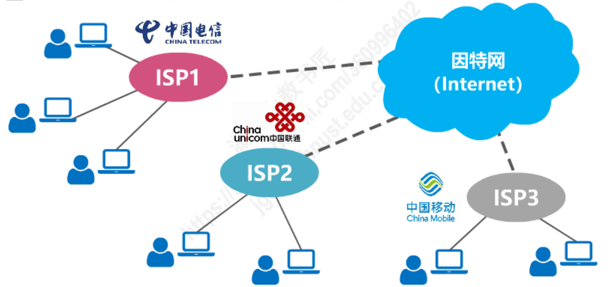
ISP可分为不同层次的ISP：

* 主干ISP：**由几个专门的公司创建和维护**。该ISP的服务范围最大（一般能够覆盖整个国家）
* 地区ISP：地区ISP**通过一个或多个主干ISP连接起来**。数据率相对较低。
* 本地ISP：本地ISP可以直接向用户提供服务，也可以直接连入地区ISP或主干ISP。**绝大多数的网络用户，都是连接到本地ISP的**。

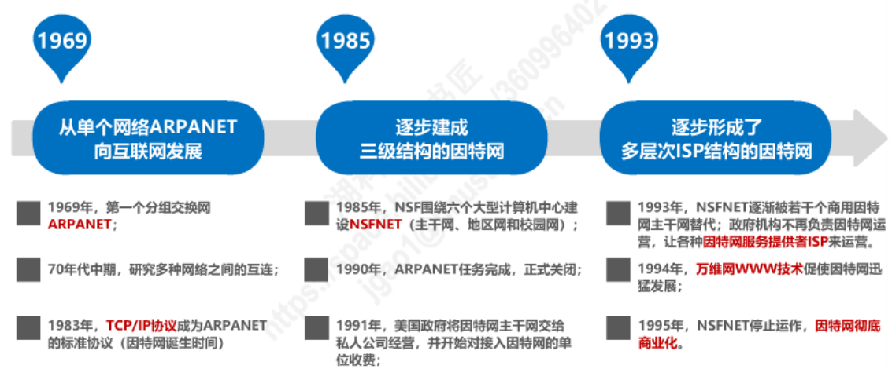

## 互联网的标准化工作

* 因特网的标准化工作对因特网的发展起到了非常重要的作用。

* 因特网在指定其标准上的一个很大的特点就是**面向公众**。
  * 因特网所有的**RFC(Request For Comments)技术文档**都可以从因特网上免费下载；<a href="https://www.ietf.org/rfc/">下载地址</a>
  * 所有人都可以随时用电子邮件发表对某个文档的意见或建议。
* 因特网协会ISOC是一个国际性组织，它**负责对因特网进行全面管理，以及在世界范围内促进其发展和使用**。
  * 因特网体系结构委员会**IAB**，**负责管理因特网有关协议的开发。**
  * 因特网工程部**IETF**，负责研究中短期工程问题，**主要针对协议的开发和标准化；**
  * 因特网研究部**IRTF**，**从事理论方面的研究和开发一些需要长期考虑的问题。**
  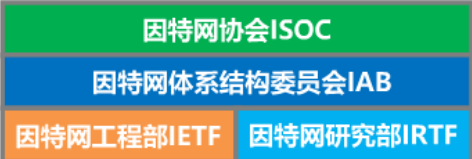
* 制定因特网的正式标准要经过以下4个阶段：
  * 阶段一: **因特网草案(该阶段还不是RFC文档)**
  * 阶段二: **建议标准(该阶段意味着开始称为RFC文档)**
  * 阶段三: **草案标准**
  * 阶段四: **因特网标准**

## 互联网的组成

&emsp;&emsp;从工作方式上看，互联网基本可以划分以下两大块：

* 边缘部分: 由所有连接在互联网上的主机组成。这部分是**用户直接使用的**，用于进行通信和资源共享。
* 核心部分: 由大量网络和连接这些网络的路由器组成。这部分是**为边缘部分提供服务的(提供连通性和交换)**。
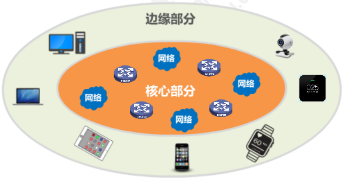

### 边缘部分

&emsp;&emsp;处在互联网边缘部分的就是**连接在互联网上的所有主机**。这些主机也被称为**端系统**。端系统可以是一台普通人的电脑，也可以是一部能上网的智能手机甚至是一个很小的摄像头，而更大的端系统就是服务器。**边缘部分利用核心部分所提供的服务，使众多主机之间能够互相通信并交换或共享信息。** 而计算机之间的通信就是：**主机A的某个进程和主机B上的另一个进程进行通信。**
&emsp;&emsp;网络边缘的端系统之间的通信方式可划分为两大类:**客户-服务器方式(C/S方式)** 和**对等方式(P2P方式)**。

* C/S方式: Client/Server方式；
* P2P方式: Peer-to-Peer方式;

### 核心部分

&emsp;&emsp;在网络核心部分中起特殊作用的是**路由器**，它是一种专门计算机(不叫主机)。路由器是实现**分组交换**的关键构件，其任务就是转发收到的分组，这是网络核心部分最重要的功能。

&emsp;&emsp;除分组交换外，还有**电路交换**和**报文交换**两种交换方式。

1. 电路交换
    * 电话交换机接通电话线的方式称为电路交换。
    * 从通信资源的分配角度来看，交换就是按照某种方式动态地分配传输路线的资源。
    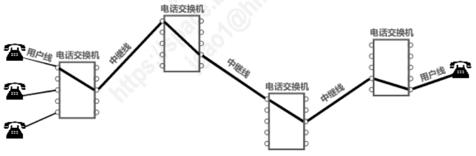
    * 电路交换的三个步骤
        * **建立连接**(分配通信资源)
        * **通话**(一直占用通信资源)
        * **释放连接**(归还通信资源)
        

> 由图不难看出：**当使用电路交换来传送计算机数据时，其线路的传输效率往往很低**。因为当线路两端的主机不需要传输数据时，已被用户占用的通信资源在大部分时间里都是空闲的。

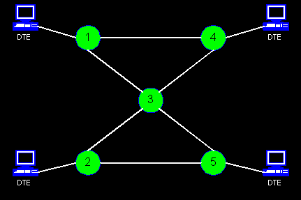

2. 分组交换( $! ! ! !$)
&emsp;&emsp;分组交换则采用**存储转发**技术。分组交换会把一个报文划分为几个分组后再进行传递。通常我们将**要发送的整块数据称为报文**。在发送报文之前，会将较长的报文划分为一个个更小的等长数据段。在每一个数据段之前，会加入一些**必要的控制信息组成的首部**后就构成了分组。分组又称为**包**，分组的首部又称为**包头**。

> 分组是在互联网中传送的数据单元;分组的**首部**是十分重要的，正因为分组的首部包含了重要的控制信息，每一个分组才能在互联网中独立地选择传输路径，并被正确地交付到分组传输的终点。

&emsp;&emsp;下图强调的是互联网核心部分是**由许多网络和把它们互连起来的路由器**组成，而主机处在互联网的边缘部分。在互联网核心部分的**路由器之间一般用高速链路相连接**，而在网络边缘部分的**主机接入到核心部分则通常以相对较低速率的链路相连接**。
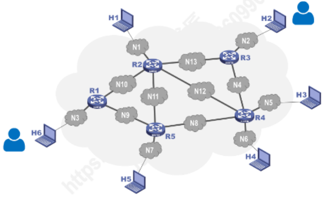

* 主机是用户进行信息处理的。

* 路由器则用来转发分组，即进行分组交换。

- - -

&emsp;&emsp;路由器暂时存储的是一个个短分组，而不是整个的长报文。**短分组是暂存在路由器的存储器**中而不是存储在磁盘中，这就保证了较高的交换速率。实际上，互联网可以容许非常多的主机同时进行通信，而一台主机中的多个进程(即正在运行中的多道程序)也可以各自和不同主机中的不同进程进行通信。应当注意的是，分组交换在传送数据之前不必先占用一条端到端的通信资源。**分组在哪段链路上传送才占用哪段链路的通信资源**。分组到达一个路由器后，先暂时存储下来，查找转发表，然后从另一条合适的链路转发出去(会**依据某种协议自动找到转发分组最合适的路径**)。分组在传输时就这样逐段地断续占用通信资源，而且还省去了建立连接和释放连接的开销，因而数据的传输效率更高。

> 由以上可知，采用存储转发的分组交换，实质上是采用了在数据通信的过程中断续分配传输带宽的策略。

3. 报文交换
&emsp;&emsp;分组交换中所采用的断续分配传输带宽的存储转发原理并非是一种全新概念。在20世纪40年代，电报通信就采用了基于存储转发原理的**报文交换**。在报文交换中心，一份份电报被接收下来，并穿插成纸带。操作员以每份报文为单位，撕下纸带，根据报文的目的站地址，拿到相应的发报机转发出去。**这种报文交换的时延较长**，从几分钟到几小时不等。**分组交换虽然也采用了这种存储转发原理，但由于使用了计算机进行处理**，因此分组的转发就会是一件非常迅速的事情。

4. 三种交换方式的特点
    **电路交换**: 整个报文的比特流连续地从源点直达终点，好像在一个管道中传达。
    **报文交换**: 整个报文先传送到相邻节点，全部存储下来后查找转发表，转发到下一个节点。
    **分组交换**: 单个分组传送到相邻节点，存储下来后查找转发表，转发到下一个节点。
    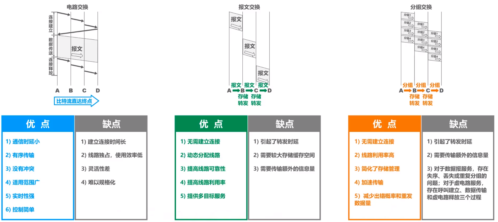
