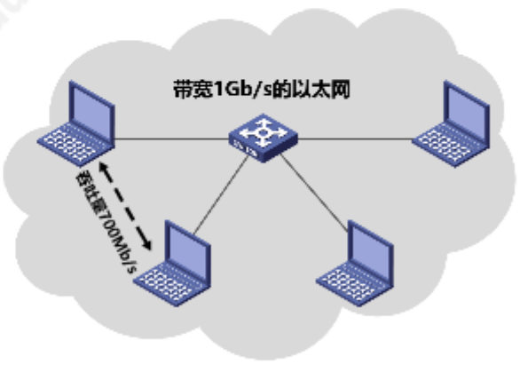
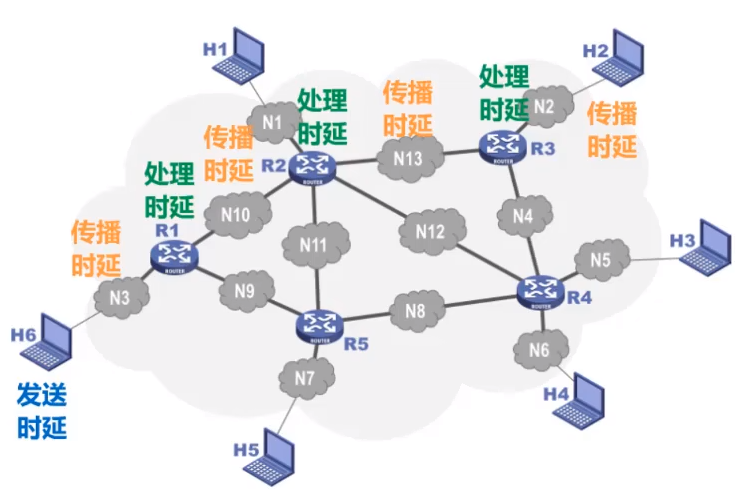
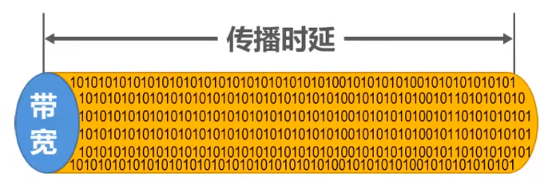
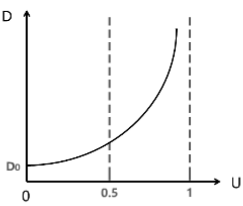

# 计算机网络性能评价指标

- 速率
- 带宽
- 吞吐量
- 时延
- 时延带宽积
- 往返时间RTT
- 利用率
- 丢包率

## **1. 速率**

&emsp;&emsp;速率指的是**数据的传送速率**，也称为"数据率"或"比特率"。**比特是信息论中使用的信息量的单位**。一个比特在信息存储中代表一位"0"或"1"。一个字节具有八个比特。相关的数据量单位关系如下:

- $1 Byte = 8 bit$
- $1 KB = 2^{10}Byte$ = $(2^{10} * 8) bits$
- $1 MB = 2^{10}KB$
- $1 GB = 2^{10}MB$
- $1 TB = 2^{10}GB$

&emsp;&emsp;连接在计算机网络上的主机**在数字信道上传送比特的速率**称为比特率或数据率。常用的数据率单位如下：

- 1bit在数字信道上经过1s传送到指定位置，其速率为$1bits/s$或$1b/s,1bps$
- $1kb/s = 10^3b/s$
- $1Mb/s = 10^3kb/s$
- $1Gb/s = 10^3Mb/s$
- $1Tb/s = 10^3Gb/s$。

> **注意：** 数据量的单位量级与速率的单位量级是不一致的。前者是$2^{10}$，后者是$10^3$。这就意味着，$1Gb/s$不代表着1s内在数字信道上传送的数据量为$1Gb = (2^{10} *2^{10}* 2^{10} *8 )bit$,而是$(10^3*10^3*10^3)bit.$

## **2. 带宽**

&emsp;&emsp;带宽在模型信号系统中的意义是:信号所包含的各种不同频率成分所占据的频率范围。其单位是:**Hz(kHz、MHz、GHz)**

&emsp;&emsp;带宽在计算机网络中的意义是：用来表示网络的通信线路所能传送数据的能力，因此网络带宽表示在单位时间内从网络中的某一点到另外一点所能通过的**最高数据量**。单位是:**b/s(kb/s,Mb/s,Gb/s,Tb/s)**

> 换句话就是：在计算机网络中，**带宽是最大速率**。一条通信链路的"带宽"越宽，所能传输的"最高数据率"也越高。

## **3. 吞吐量**

&emsp;&emsp;吞吐量表示在**单位时间内通过某个网络(或信道、接口)的实际数据量**。

&emsp;&emsp;吞吐量经常被用于对现实世界中的网络的一种测量，以便知道实际上到底有多少数据量能够通过网络。

&emsp;&emsp;吞吐量**受网络的带宽或额定速率的限制**。

> 必须明确，吞吐量是单位时间内通过某个网络的**实际数据量**。例如:某以太网的速率为:$1GB/s$,则其 **实际通过的数据量(吞吐量)** 可能为$700Mb/s$。

## **4. 时延**

&emsp;&emsp;时延是指**数据从网络的一端传送到另一端所需的时间**。有时也被称为**延迟**或**迟延**。

&emsp;&emsp;时延是由以下几个不同的部分组成：

- 发送时延
- 传播时延
- 处理时延
- 排队时延

即:**总时延 = 发送时延 + 传播时延 + 处理时延 + 排队时延**

&emsp;&emsp;(1) 发送时延：发送时延是**主机或路由器发送数据帧所需要的时间**。也就是从发送数据帧的第一个比特算起，到该帧的最后一个比特发送完毕所需要的时间。计算公式如下：

$$
发送时延 = \frac{数据帧长度(bit)}{发送速率(bit/s)}
$$

> 据此可分析出，当网络速率一定时，发送时延与数据帧的长度成正比关系(**当数据量越大，发送时延就越大**)。

- - -
&emsp;&emsp;(2) 传播时延: 传播时延是**电磁波在信道中传播一定的距离需要花费的时间**。计算公式如下:
$$
传播时延 = \frac{信道长度(m)}{电磁波在信道上的传播速率(m/s)}
$$
> 电磁波在自由空间中的传播速率是光速 - $3*10^5m/s$。在信管道中传播的速率要低一些。需要明确，传播时延与发送时延两种时延发生所在位置。**前者是发生在机器内部，后者是发生在机器外部**。

- - -
&emsp;&emsp;(3) 处理时延: 处理时延是**主机或路由器在收到分组时要花费一定的时间进行处理。这个阶段所花费的时间就是处理时延。**
- - -
&emsp;&emsp;(4) 排队时延: 分组在经过网络传输时，要经过许多路由器。但分组在进入路由器后要先在输入队列中排队等候处理。此时就产生了排队时延。**排队时延的长短取决于网络当时的通信量，当网络的通信量很大时，会发生队溢出，使得分组丢失，此时的排队时延就为无限大**。

下图中，将排队时延放入了处理时延中进行了讨论。

## **5. 时延带宽积**

&emsp;&emsp;将**传播时延和带宽相乘**就能得到时延带宽积:

$$
时延带宽积 = 传播时延 × 带宽
$$

> 时延带宽积又称为**以比特为单位的链路长度**。其实就是表示这个链路可以容纳多少个比特。

## **6. 往返时间RTT(Round-Trip Time)**

&emsp;&emsp;在许多情况下，因特网上的信息不仅仅单方向传输，而是双向交互;我们有时很需要知道双向交互一次所需的时间，而该时间就是RTT。

## **7. 利用率**

&emsp;&emsp;利用率分为**信道利用率**和**网络利用率**。信道利用率可以指出某信道有百分之几是被利用的。**完全空闲的信道其利用率为0**。网络利用率则是全网络的信道利用率的加权平均值。**依据排队理论，当信道利用率越大，排队时延就越长，总时延也就越长**。

&emsp;&emsp;假设当前网络完全空闲时的时延为$D_0$,当前网络时延为$D$。则网络利用率$U$等于:

$$
    U = \frac{D-D_0}{D}
$$

&emsp;&emsp; 变换得:

$$
    D = \frac{D_0}{1-U}
$$

由上述公式及图可看出: 当网络利用率达到50%以上时，时延就会成倍增长。**信道利用率或网络利用率过高就会产生非常大的时延**。这也就是为什么一些ISP会对网络时延进行限制。(意味着当有大量人群访问时，网速会有所下降)。

- - -

## **8. 丢包率**

&emsp;&emsp;丢包率即分组丢失率，是指在一定时间范围内，传输过程中**丢失的分组数量与总分组数量的比率**。丢包率具体可分为接口丢包率、结点丢包率、链路丢包率、路径丢包率、网络丢包率等。

&emsp;&emsp;分组丢失主要有两种情况:

- 分组在传输过程中 **出现误码，被结点丢弃** ；
- 分组**到达一台队列已满的分组交换机时被丢弃**；

&emsp;&emsp;丢包率可以反映网络的拥塞情况:

- 无拥塞：0%
- 轻度拥塞: 1% ~ 4%
- 严重拥塞: 5% ~ 15%
