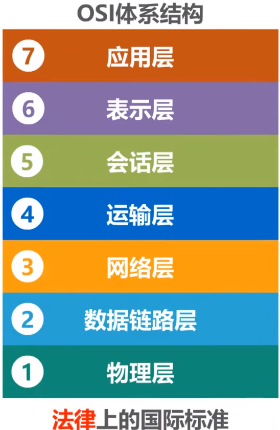

# 计算机网络体系结构

- OSI体系结构
- TCP/IP体系结构
- 原理体系结构

## 计算机网络体系结构分层的必要性

**1.计算机网络是个非常复杂的系统。早在最初的ARPANET设计时就提出了分层的设计理念**。

**2."分层"可将庞大而复杂的问题，转换为若干较小的局部问题，而这些较小的局部问题就比较易于研究和处理**。

**3.要想两台主机之间通信，需要有以下几个工作**

  - 采用什么传输媒体(介质)？
  - 采用什么物理接口？
  - 采用什么信号来表示比特0和1？
  - 如何标识网络中的各主机(主机编址问题，例如MAC地址)？
  - 如何从信号所表示的一连串比特流中区分地址和数据？
  - 如何协调各主机争用总线？
  - 如何标识各网络以及网络中的各主机(网络和主机共同编址的问题，例如IP地址)？
  - 路由器如何转发分组，如何进行路由选择？
  - 如何解决进程之间基于网络的通信问题？
  - 出现传输错误时，如何处理？
  - 如何通过应用进程间的交换来完成特定的网络应用？

## OSI 体系结构(面试高频题)

&emsp;&emsp;OSI 模型(OSI/RM,**Open Systems Interconnection Reference Model**)全称为开放式通信系统互连参考模型，是**国际标准化组织 ( ISO )** 提出的一个试图使各种计算机在世界范围内互连为网络的标准框架。 OSI 将计算机网络体系结构划分为七层，每一层实现各自的功能和协议，并完成与相邻层的接口通信。OSI 的服务定义详细说明了各层所提供的服务。**某一层的服务就是该层及其下各层的一种能力，它通过接口提供给更高一层**。各层所提供的服务与这些服务是怎么实现的无关。

- **应用层**

&emsp;&emsp;应用层位于 OSI 参考模型的第七层，其作用是**通过应用程序间的交互来完成特定的网络应用**。该层协议定义了**应用进程之间的交互规则**，通过**不同的应用层协议为不同的网络应用提供服务**。例如域名系统 DNS，支持万维网应用的 HTTP 协议，电子邮件系统采用的 SMTP 协议等。在应用层交互的数据单元我们称之为报文。

- **表示层**

&emsp;&emsp;表示层的作用是**使通信的应用程序能够解释交换数据的含义**，其位于 OSI 参考模型的第六层，**向上为应用层提供服务，向下接收来自会话层的服务**。该层提供的**服务主要包括数据压缩，数据加密以及数据描述**。这使得应用程序不必担心在各台计算机中表示和存储的内部格式差异。

- **会话层**

&emsp;&emsp;会话层就是**负责建立、管理和终止表示层实体之间的通信会话**。该层提供了数据交换的定界和同步功能，包括了建立检查点和恢复方案的方法。

- **运输层**

&emsp;&emsp;运输层的主要任务是**为两台主机进程之间的通信提供服务**。应用程序利用该服务传送应用层报文。该服务并不针对某一特定的应用，**多种应用可以使用同一个运输层服务**。由于一台主机可同时运行多个线程，因此运输层有复用和分用的功能。所谓复用就是指**多个应用层进程可同时使用下面运输层的服务**，分用和复用相反，是运输层把收到的信息分别交付上面应用层中的相应进程。

- **网络层**

&emsp;&emsp;两台计算机之间传送数据时其通信链路往往不止一条，所传输的信息甚至可能经过很多通信子网。网络层的主要任务就是选择合适的网间路由和交换节点，确保数据按时成功传送。在发送数据时，网络层把传输层产生的报文或用户数据报封装成分组和包向下传输到数据链路层。在网络层使用的协议是无连接的网际协议（Internet Protocol）和许多路由协议，因此我们通常把该层简单地称为 IP 层。

- **数据链路层**

&emsp;&emsp;数据链路层通常也叫做链路层，在物理层和网络层之间。**两台主机之间的数据传输，总是在一段一段的链路上传送的，这就需要使用专门的链路层协议**。在两个相邻节点之间传送数据时，数据链路层将网络层交下来的 IP 数据报**组装成帧**，在两个相邻节点间的链路上传送帧。每一帧包括数据和必要的控制信息。**通过控制信息我们可以知道一个帧的起止比特位置**，此外，也能使接收端检测出所收到的帧有无差错，如果发现差错，数据链路层能够简单的丢弃掉这个帧，以避免继续占用网络资源。

- **物理层**

&emsp;&emsp;作为 OSI 参考模型中最低的一层，物理层的作用是**实现计算机节点之间比特流的透明传送，尽可能屏蔽掉具体传输介质和物理设备的差异**。使其上面的数据链路层不必考虑网络的具体传输介质是什么。该层的主要任务是**确定与传输媒体的接口的一些特性（机械特性、电气特性、功能特性，过程特性）**。

## TCP/IP 体系结构

&emsp;&emsp;OSI 七层模型在提出时的出发点是基于标准化的考虑，而**没有考虑到具体的市场需求**，使得该模型**结构复杂，部分功能冗余**，因而完全实现 OSI 参考模型的系统不多。而 TCP/IP 参考模型**直接面向市场需求**，实现起来也比较容易，因此在一经提出便得到了广泛的应用。基于 TCP/IP 的参考模型将协议分成四个层次，如上图所示，它们分别是：**网络访问层、网际互联层、运输层、和应用层**。

- **应用层**

&emsp;&emsp;TCP/IP 模型将 OSI 参考模型中的**会话层、表示层和应用层的功能合并到一个应用层实现**，通过不同的应用层协议为不同的应用提供服务。例如：FTP、Telnet、DNS、SMTP 等。

- **运输层**

&emsp;&emsp;该层对应于 OSI 参考模型的运输层，为上层实体提供源端到对端主机的通信功能。传输层定义了两个主要协议：**传输控制协议（TCP）**和**用户数据报协议（UDP）**。其中面向连接的 TCP 协议保证了数据的**传输可靠性**，面向无连接的 UDP 协议能够实现数据包**简单、快速地传输**。

- **网际互联层**

&emsp;&emsp;网际互联层对应 OSI 参考模型的网络层，主要**负责相同或不同网络中计算机之间的通信**。在网际互联层， IP 协议提供的是一个**不可靠、无连接的数据报传递服务**。该协议实现两个基本功能：**寻址**和**分段**。根据数据报报头中的目的地址将数据传送到目的地址，在这个过程中 IP 负责**选择传送路线**。除了 IP 协议外，该层另外两个主要协议是**互联网组管理协议（IGMP）**和**互联网控制报文协议（ICMP）**。

- **网络接入层**

&emsp;&emsp;网络接入层的功能对应于 OSI 参考模型中的**物理层和数据链路层**，它**负责监视数据在主机和网络之间的交换**。事实上，TCP/IP 并未真正描述这一层的实现，而由参与互连的各网络使用自己的物理层和数据链路层协议，然后与 TCP/IP 的网络接入层进行连接，因此具体的实现方法将随着网络类型的不同而有所差异。

## 原理体系结构

&emsp;&emsp;当讲授计算机网络原理时，常采用原理体系结构进行讲解，因为这五层结构对于阐述计算机网络的原理是十分方便的。

- **应用层**

&emsp;&emsp;解决通过应用进程的交互来实现特定网络应用的问题。

- **运输层**

&emsp;&emsp;解决进程之间基于网络的通信问题。

- **网络层**

&emsp;&emsp;解决分组在多个网络上传输(路由)的问题。

- **数据链路层**

&emsp;&emsp;解决分组在一个网络(或一段链路)上传输的问题。

- **物理层**

&emsp;&emsp;解决使用何种信号来传输比特的问题。
