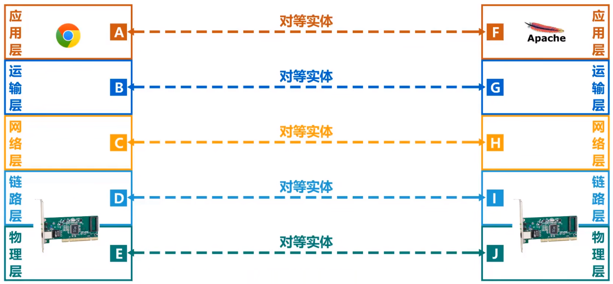
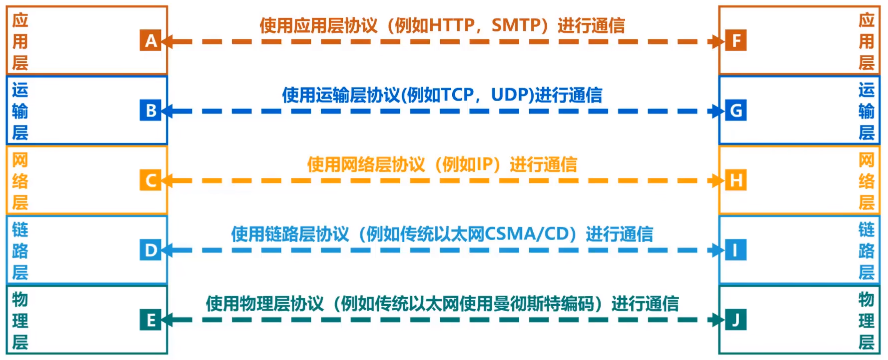
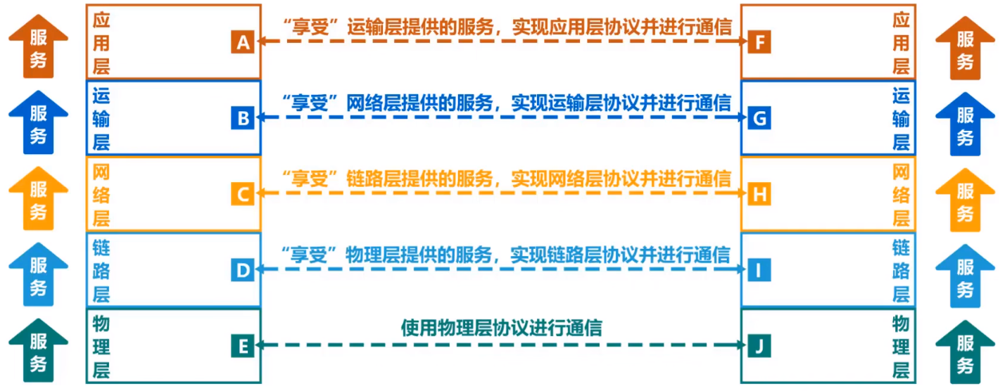
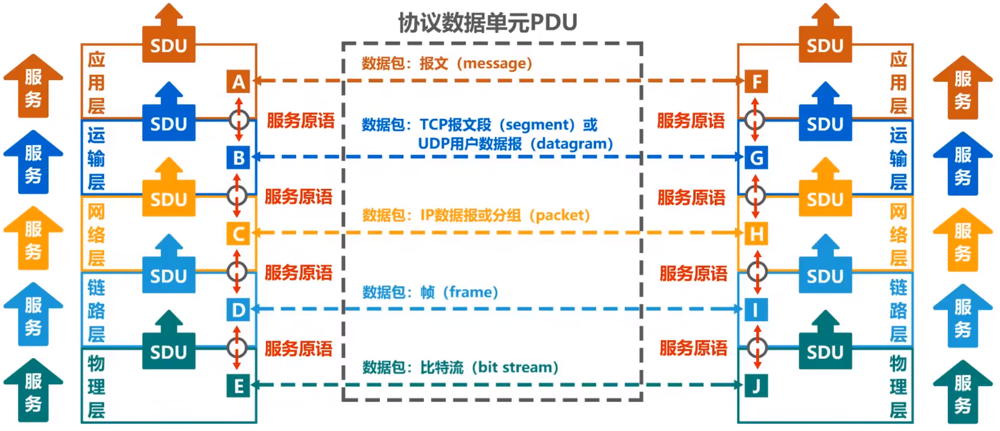

# 计算机网络体系结构专用术语

- 实体
- 协议
- 服务

## 实体

1. 实体：**任何可发送或接收信息的硬件或软件进程**。在很多情况下，实体就是一个特定的软件模块。
2. 对等实体：收发双方**相同层次中的实体**。

&emsp;&emsp;例如：下图所示，字母A~J表示实体，A与F、B与G、C与H等都是对等实体。

## 协议

1. 协议：协议是**控制两个(或多个)对等实体进行通信规则的集合**。

&emsp;&emsp;协议的语法方面的规则定义了所交换的信息的格式，协议的语义方面的规则定义了发送者或接收者所要完成的操作，协议的同步定义了收发双方的时序关系。**语法、语义和同步是协议的三要素。**

## 服务

&emsp;&emsp;**在协议的控制下，两个对等实体间的逻辑通信使得本层能够向上一层提供服务。要实现本层的协议，还需要使用下面一层所提供的服务**。
&emsp;&emsp;使用本层服务的实体只能看见服务而无法看见下面的协议。**下面的协议对上面的实体是透明的**。

&emsp;&emsp;由图可知，因为协议是控制对等实体之间通信的规则，因此，**协议是“水平的”**。服务是由下层向上层通过层间接口提供的，因此，**服务是“垂直的”**。
> 并非在一个层内完成的全部功能都称为服务，只有那些能够被高一层的实体“看得见”的功能才能称为服务。在OSI体系结构中，上层使用下层所提供的服务必须通过**与下层交换一些命令**，而这些命令称为 **服务原话**。

&emsp;&emsp;**在同一个系统中相邻两层的实体进行交互的地方**称为**服务访问点(SAP,Service Access Point)**。SAP是一个抽象的概念，实际上就是一个逻辑接口。OSI把**层与层之间交换的数据的单位**称为**服务数据单元(SDU，Service Data Unit)**，把**对等层次之间传送的数据单元**称为该层的**协议数据单元(PDU,Protocol Data Unit)**.

