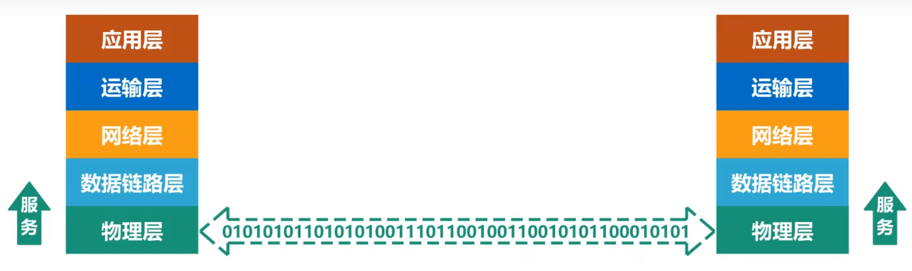

# 物理层的基本概念

> &emsp;&emsp;作为OSI参考模型的最低的一层，物理层是整个开发系统的基础，该层利用传输介质为通信两端建立、管理和释放物理连接，实现比特流的透明传输。

&emsp;&emsp;物理层考虑的是**怎样才能在连接各种计算机的传输媒体上传输数据比特流**，而不是指具体的传输媒体。由于现有的计算机网络中的硬件设备和传输媒体种类繁多，而通信手段也有许多方式。

&emsp;&emsp;物理层的作用正是要**尽可能地屏蔽掉这些传输媒体和通信手段的差异，使得物理层上面的数据链路层感觉不到这些差异(变得透明)**，这样就可以使数据链路层只用考虑如何实现本层的协议和服务，而不必考虑网络具体的传输媒体和通信手段。

&emsp;&emsp;物理层的主要任务可以描述为**确定与传输媒体的接口有关的一些特性**

- **机械特性**：指明接口所用接线器的形状和尺寸、引脚数目和排列、固定和锁定装置等。
- **电气特性**：指明在接口电缆的各条线上出现的电压范围。
- **功能特性**：指明某条线上出现的**某一电平的电压**的意义。
- **过程特性**：指明对于不同功能的各种可能事件的出现顺序。

