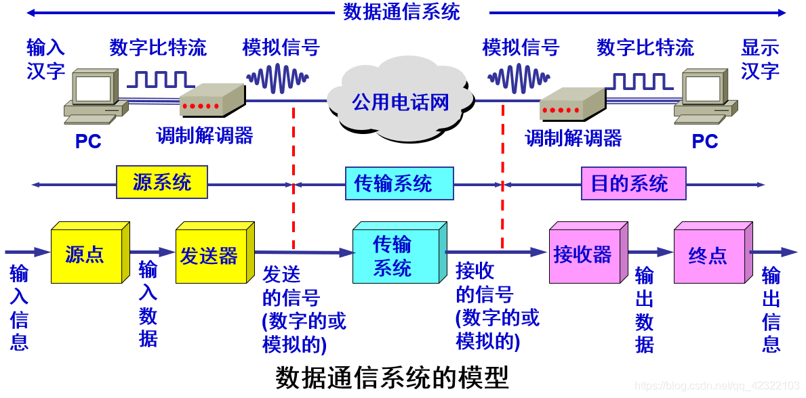
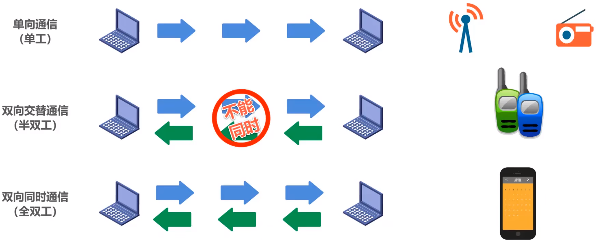
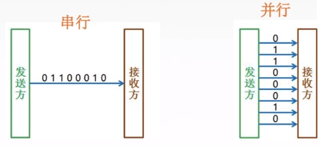
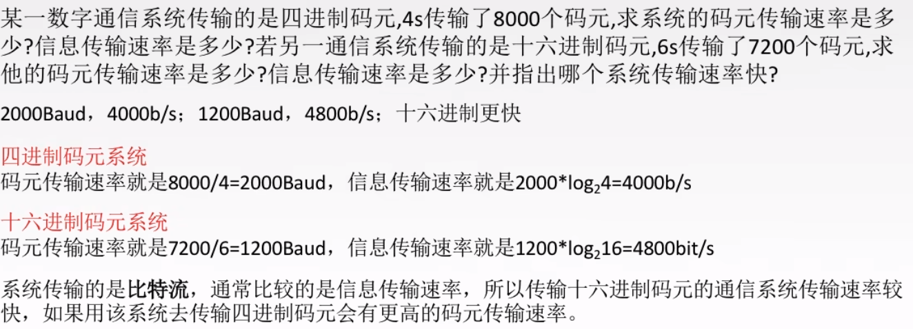
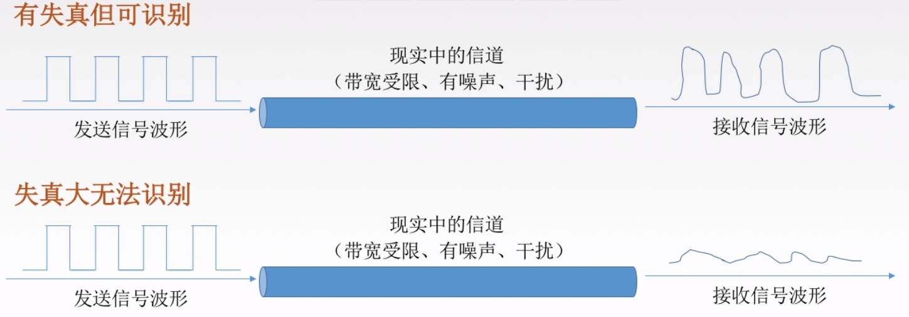
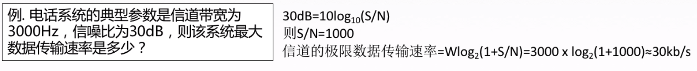
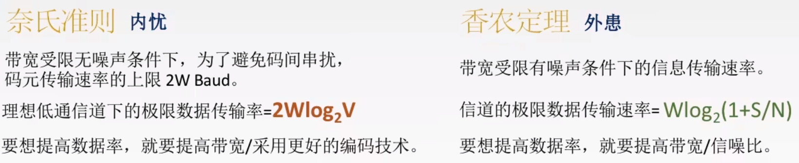

# 数据通信的基础知识

&emsp;&emsp;一个数据通信系统可划分为三大部分:**源系统、传输系统**和**目的系统**。

&emsp;&emsp;源系统一般包括两部分:**源点**和**发送器**。目的系统一般包括：**接收器**和**终点**。

&emsp;&emsp;通信的目的是发送消息。

- 数据是消息的实体，通常是有意义的符号序列。

- 信号是数据的电气或电磁的表现,是数据在传输过程中的存在形式。

- 信源是产生和发出信息的源头。信宿是接收数据的终点。

- 信道是信号的传输媒介。一般用来表示向某一个方向传送信息的媒介，因此一条通信线路往往包含一条发送信道和一条接收信道。

  从通信的双非信息交换的方式来看，有三种基本方式：

1. **单向通信**：发送方和接收方是固定的，消息只能单向传输。例如家庭电费、网费等数据收集系统。

2. **双向交替通信**：通信双非都可以发送消息，但同一时刻同一通道只允许单方向发送数据。例如对讲机。

3. **双向同时通信**：允许通信双方同时在两个方向上传输，其要求通信双方都具有独立的发送和接收数据的能力。例如打电话，自己说话的同时，也能听到对方说话。

---

数据在信道中的两种传输方式

- 串行传输：速度慢，费用低，适合远距离
- 并行传输：速度快，费用高，适合近距离，主要用于计算机内部的数据传输

**码元**

&emsp;&emsp;码元是指**用一个固定时长的信号波形（数字脉冲），代表不同离散数值的基本波形**，是**数字通信中数字信号的计量单位**，这个时长内的信号称为**k进制码元**，而该时长称为**码元宽度**。当码元的离散状态有M个时（M>2），此时码元为M进制码元。

> 1码元可以携带多个比特的信息量。例如在使用二进制编码时，只有两种不同的码元，一种表示0状态，另外一种表示1状态。
 *计算关键：** M进制码元 = $log_2M$ $bit$

&emsp;&emsp;速率可以用**码元传输速率**和**信息传输速率**表示。

1. **码元传输速率**
&emsp;&emsp;码元传输速率又叫码元速率、波形速率、调制速率、符号速率等。它表示**单位时间内数字通信系统所传输的码元个数**（也可称为**脉冲个数或信号变化的次数**），单位是**波特（Baud）**。$1$波特表示数字通信系统每秒传输一个码元。这里的码元可以是多进制的，也可以是二进制的，但码元速率与进制数无关。

2. **信息传输速率**
&emsp;&emsp;信息传输速率又叫信息速率、比特率，表示**单位时间内数字通信系统传输的二进制码元个数（即比特数）**，单位是比特/秒（b/s）。

**码元传输速率与信息传输速率的关系**
> 若一个码元携带$n$ $bit$的信息量，则$M$ $Baud$的码元传输速率所对应的信息传输速率为$M×n$ $bit/s$.

## 奈氏准则与香农定理

&emsp;&emsp;任何实际的信道都不是理想的，都不可能以任意高的速率进行传送。数字通信的优点就是：**虽然信号在信道上传输时会不可避免地产生失真，但在接收端只要我们从失真的波形中识别出原来的信号，那么这样的失真对通信质量来说就是无影响的**。若失真十分严重，导致我们无法从失真的波形中识别出原来的信息，那么就需要寻找一个有效措施降低失真程度。

影响失真的因素：

- 码元传输速率
- 信号传输距离
- 噪声干扰
- 传输媒体质量

- - -
&emsp;&emsp;如果信号中的高频分量在传输时受到衰减，那么在接收端收到的波形前沿和后沿就变得不那么陡峭了，每个码元所占的时间界面也不再是很明确的，而是前后都拖了“尾巴”。这种**接收端收到的信号波形失去了码元之间清晰界限的**现象称为"**码间串扰**"。

- - -

1. **奈氏准则**
&emsp;&emsp;**在理想低通(无噪声，带宽受限)条件下，为了避免码间串扰，极限码元传输速率为**$2W$ $Baund$,$W$**是故信道带宽，单位**$Hz$.

> 在奈氏准则和香农定理中，带宽一律采用$Hz$为单位（$带宽 = Max(Hz) - Min(Hz)$）。其它情况采用最高速率表示。

&emsp;&emsp;在奈氏准则中：
$$
理想低通信道下的极限数据率 = 2Wlog_2V(bit/s)
$$
&emsp;&emsp;其中$W$表示带宽，$V$表示**几种码元**或**码元的离散电平数**。

&emsp;&emsp;**相关结论**

- 在任何信道中，**码元传输的速率都是有上限的**。若传输速率超过此上限，就会出现严重的码间串扰问题，使接收端对码元的完全正确识别称为不可能。
- 信道的**频带越宽**(即能通过的信号高频分量越多)，就可以用更高的速率进行码元的有效传输。
- **奈氏准则给出了码元传输速率的限制，但并没有对信息传输速率给出限制。**
- 由于码元的传输速率受奈氏准则的制约，所以要提高数据的传输速率，就必须设法使用每个码元能携带更多比特的信息量，这就需要采用多元制的调制方法。

2. **香农定理**

&emsp;&emsp;噪声存在与所有的电子设备和通信信道中。由于噪声随机产生，它的瞬时值有时会很大，因此噪声会使接收端对码元的判决产生错误。噪声的影响是相对的，若信号较强，那么噪声影响相对较小。因此，噪声比就很重要了。
$$
    噪声比 = \frac{信号的平均功率}{噪声的平均功率}
$$
&emsp;&emsp;记为$\frac{S}{B}$,并用分贝($db$)作为度量单位，即：
$$
    噪声比(dB) = 10log_{10}{\frac{S}{N}}
$$

&emsp;&emsp;为表达更加简洁和美观，对噪声比$\frac{S}{N}$进行了适当的变化，**变化后的噪声比以$dB$为度量单位**。

**香农定理**：在带宽受限且有噪声的信道中，为了不产生误差，信息的数据传输速率有上限值。
$$
信道的极限数据传输速率 = Wlog_2{(1+\frac{S}{N})} \text(b/s)
$$

> **注意**：香农定理中的噪声比$\frac{S}{N}$不是以$dB$为度量单位的，在实际计算中，**若给出了以$dB$为单位的噪声比，则需要转换为无$dB$为单位度量的噪声比。**

&emsp;&emsp;**相关结论**

- 信道的带宽或信道中的信噪比越大，则信息的极限传输速率就越高。
- 对一定的传输带宽和一定的信噪比，信息传输速率的上限就确定了。
- 只要信息的传输速率低于信道的极限传输速率，就一定能招到某种方法来实现无差错的传输。
- 香农定理得出的为极限信息传输速率，实际信道能达到的传输速率要比它低不少。
- 从香农定理可以看出，若信道带宽$W$或信噪比$\frac{S}{N}$没有上限，那么信道的极限信息传输速率也就没有上限。(不可能出现)

3. **奈氏准则与香农定理的区别**

