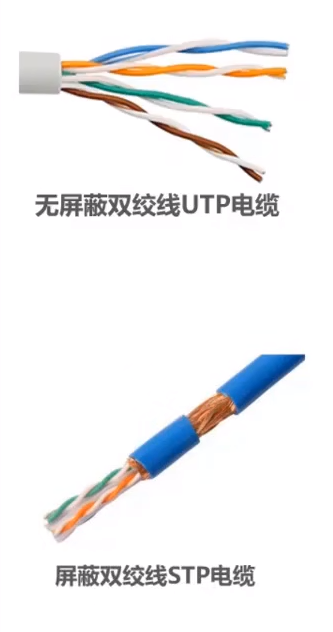
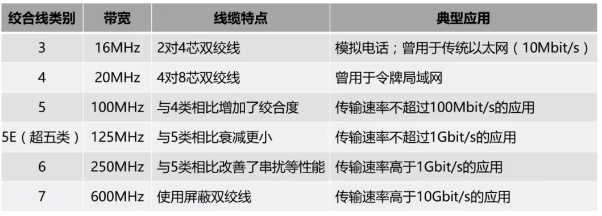
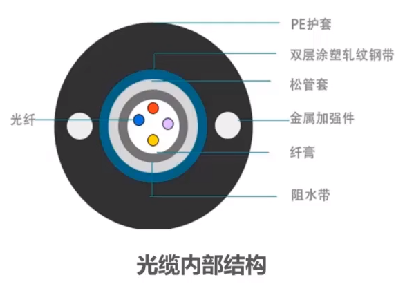
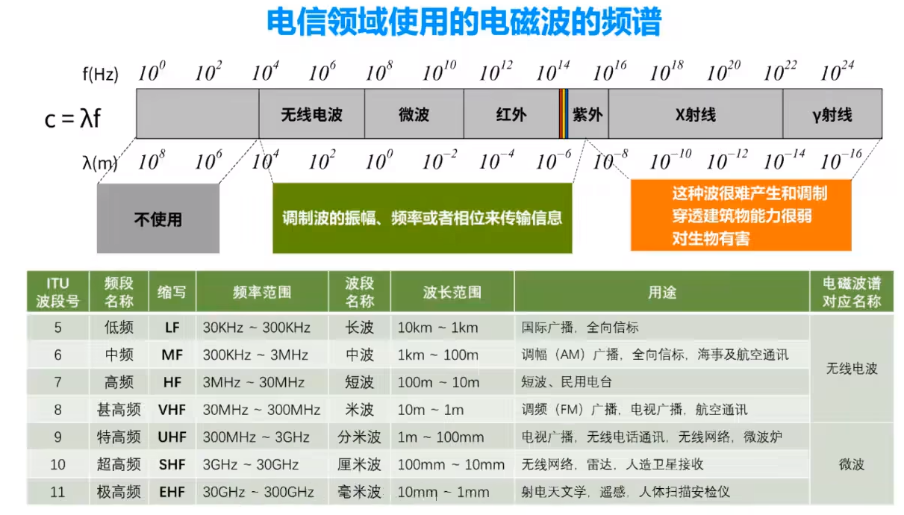

# 物理层下面的传输媒体

导引型传输媒体

  - 同轴电缆
  - 双绞线
  - 光纤
  
非导引型传输媒体

  - 无限电微波

&emsp;&emsp;**传输媒体不属于计算机网络体系结构中的任何一层**，若非要将其放入计算机网络体系结构中，那么它也只能在物理层之下。**传输媒体**也称为传输介质或传输媒介，是数据传输系统中在发送器和接收器之间的物理通路。传输媒体可分为两大类：**导引型传输媒体**和**非导引型传输媒体**。

&emsp;&emsp;在导引型传输媒体中，电磁波被导引沿着固定媒体（光纤）传播；非导引型传输媒体就是指自由空间，在非导引型媒体中电磁波的传输常称为无线传输。

## 导引型传输媒体

### **同轴电缆**

&emsp;&emsp;同轴电缆由内导体铜制芯线、绝缘层、网状编织的外导体屏蔽层以及绝缘保护套层组成，它们同轴，因此称为同轴电缆。

&emsp;&emsp;同轴电缆在局域网发展的初期被广泛地使用，现随着计数的进步，在局域网领域上不再使用同轴电缆，而是使用双绞线。**同轴电缆的带宽取决于电缆的质量**

### **双绞线**

&emsp;&emsp;将两根互相绝缘的铜导线并排放在一起，然后用规则的方法绞合起来就构成了双绞线。绞合不仅可以**抵御部分来自外界的电磁波干扰**，还可以**减少相邻导线的电磁干扰**。

> 常用的绞合线的类别、带宽和典型应用

### **光纤**

&emsp;&emsp;光纤是光纤通信的传输媒体。光纤通信就是利用光导纤维（简称：光纤）传递光脉冲来进行通信的。

&emsp;&emsp;光纤优点：
  
- 通信容量大。
- 传输损耗小，中继距离长，对远传输特别经济。
- 抗雷电和电磁干扰性能好。
- 无串音干扰，保密性好，也不容易被窃听或截取数据。
- 体积小，重量轻。

## 非导引型传输媒体

