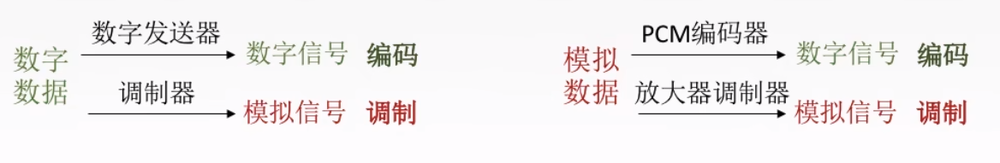
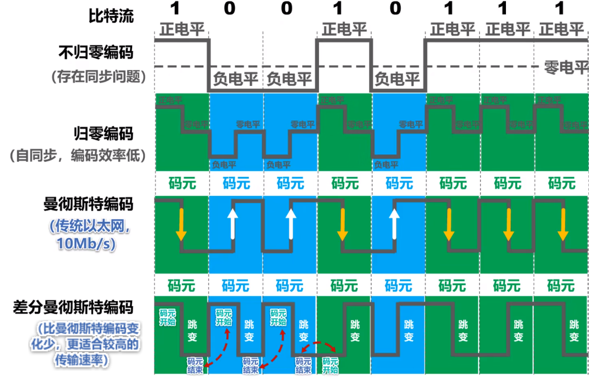
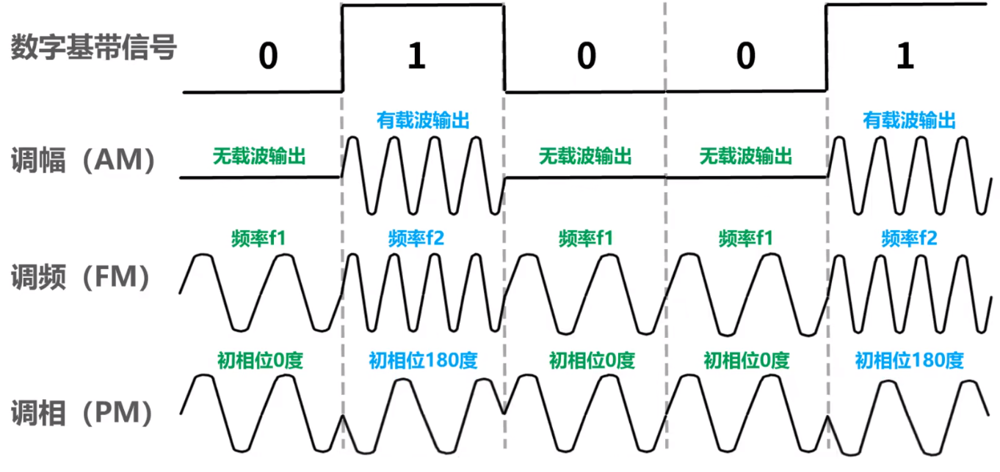
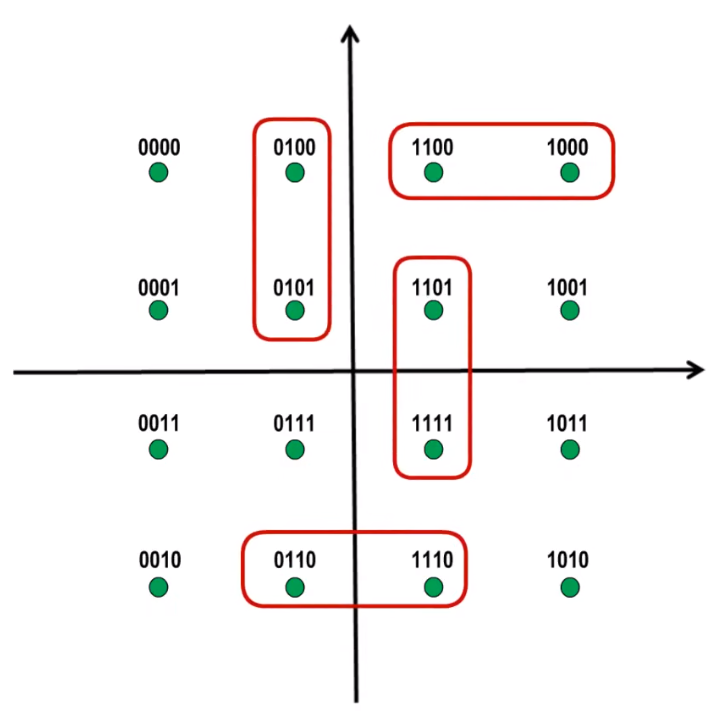

# 编码与调制

- 信道
- 信道上传送的信号
- 编码与调制
- 数字数据编码为数字信号
- 数字数据调制为模拟信号

## **信道**
&emsp;&emsp;信道是信号的传输媒介。一般用来表示向某一个方向传送信息的介质，因此一条通信线路往往包含一条发送信道和一条接收信道。信道依据不同标准可以划分为不同的信道：

- 依据**传输信号**进行划分：**模拟信道**（传送模拟信号）和**数字信道**（传送数字信号）
- 依据**传输介质**进行划分：**无线信道**和**有线信道**

## **信道上传送的信号**
&emsp;&emsp;信道上传送的信号可划分为**基带信号**和**宽带信号**。

- 基带信号：将数字信号0和1直接用两种不同的电压表示，再送到**数字信道**上去传输(基带传输)。**来自信源的信号都属于基带信号**。 基带信号就是发出的**直接表达了要传输的信息的信号**。
- 宽带信号：将基带信号进行**调制**后形成的频分复用模拟信号，再传送到模拟信道上去传输(宽带信号)。

## **编码与调制**

- 将数据转换为**数字信号**的过程称之为**编码**。
- 将数据转换为**模拟信号**的过程称之为**调制**。

## 数字数据编码为数字信号

&emsp;&emsp;编码的方式如图所示：

- **不归零编码**：正电平代表1，负电平代表0。该编码方式在接收端对连续的0或1进行编码时，会出现无法正确分辨有几个码元的情况，因此需要一根传输线传输**时钟信号**，使得接收方和发送方保持同步。但实际上，宁愿将多出来的线用于传输数据也不会将其用于发送时钟信号的。
- **归零编码**：**每个码元结束后信号都要"归零"**，所以接收方只要在信号归零后进行采样即可，而不需要单独的时钟信号。但实际上，归零编码相当于把时钟信号用"归零"的方式编码在了数据之内，这称为"**自同步**"信号。但是，归零编码的**大部分数据带宽都用来传输"归零"**而浪费掉了。
- **曼彻斯特编码**：在一个码元中，存在向上或向下跳变的信号，并将向上跳变代表0(1)，向下跳变代表1(0)。**码元中间跳变的信号既是时钟信号又是传输数据**。
- **差分曼彻斯特编码**：在一个码元的**开始部分**，若存在跳变，则表示0，不存在跳变表示1。**跳变仅表示时钟，码元开始处是否发生变化表示数据**。

## 数字数据调制为模拟信号

&emsp;&emsp;基本调制的方式如图所示：

- **调幅（AM）**：载波的振幅随基带数字信号而变化。
- **调频（FM）**：载波的频率随基带数字信号而变化。
- **调相（PM）**：载波的初始相位随随基带信号而变化。

&emsp;&emsp;基本调制只能将一码元调制为一个bit信息。因此需要采用混合调制才能使得一码元中包含更多的bit信息。例如使用：**正交振幅调制QAM**。

- QAM共有12种相位，每种相位有1或2种振幅可选。
- QAM可以调制出16种码元(波形)，每种码元可以对应表示4个bit。
- 码元与4个bit的对应关系采用格雷码：**任意两个相邻码元只有1个比特不同**。

