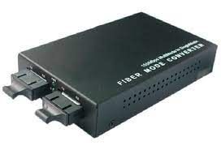
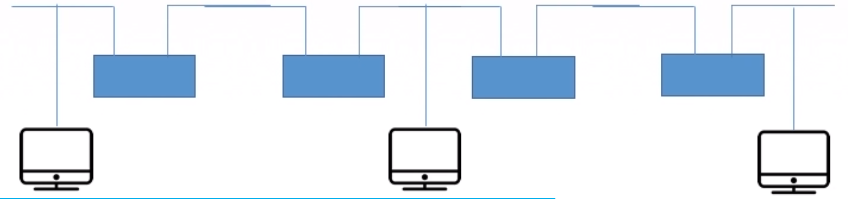
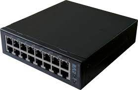

# 物理层设备

- 中继器
- 集线器

1. **中继器**

**诞生原因**：由于存在损耗，在线路上传输的信号功率会逐渐衰减，衰减到一定程度时将造成信号失真，因此会导致接收错误。
**中继器功能**：对信号进行再生和还原，对衰减的信号进行放大，保持与原数据相同，以增加信号传输的距离，延长网络的长度。简而言之，就是能够：**再生数字信号**。
**中继器的两端**：两端的网络部分是网段，而不是子网，适用于完全相同的两类网络的互连，且两个网段速率要相同。中继器只将任何电缆段上的数据发送到另一段电缆上，它仅作用于信号的电气部分，并不管数据中是否有错误数据或不适合网段的数据。**中继器两端的网段一定要是同一个协议（中继器不会存储转发）**。
**5-4-3规则**：网络标准中都对信号的延迟范围作了具体的规定，因而中继器只能在规定的范围内进行，否则会网络故障。

2. **集线器**

**集线器的功能**：对信号进行再生**放大转发**，对衰减的信号进行放大，接着转发到其它所有处于工作状态的端口上，以增加信号的传输距离，延长网络的长度。但**不具备信号的定向传送能力，是一个共享式设备**。集线器不能分割冲突域，连在集线器上的工作主机平分带宽。

