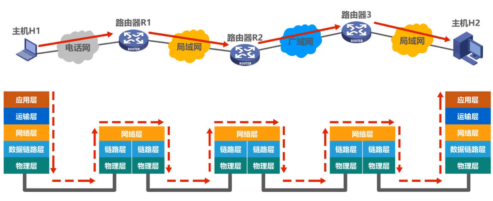
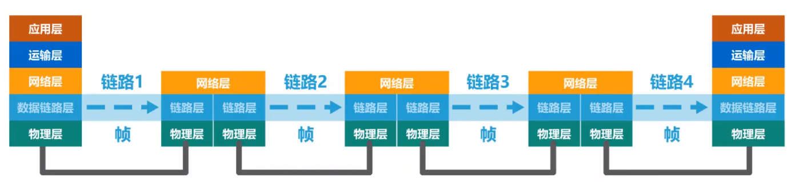

# 数据链路层概述

&emsp;&emsp;数据链路层属于计算机网络的低层。数据链路层使用的信道主要有两种类型：

- 点对点信道：使用**一对一**的点对点通信方式。
- 广播信道：使用**一对多**的广播通信方式。广播信道上连接的主机很多，因此必须使用专用的共享信道协议来协调这些主机的数据发送。

下图展现的是两台主机通过互联网进行通信时数据链路层所处的地位：

&emsp;&emsp;主机$H_1$、$H_2$都有完整的五层协议栈，但路由器在转发分组时使用的协议栈只有下面的三层。主机$H_1$将待发送的数据包逐层封装后，通过物理层将构成数据包的各比特转换为电信号。数据包进入路由器后由下往上解封到网络层，路由器根据数据包的目的网络地址和自身转发表确定数据包的转发端口。然后从网络层向下逐层封装成数据包并通过物理层将数据包发送至传输媒体。最终当数据包到达主机$H_2$时，还要由下往上逐层解封，最终解封出主机$H_1$所发送的数据。

&emsp;&emsp;许多情况下,我们可以只关心在协议栈中水平方向的各数据链路层。于是当主机$H_1$向主机$H_2$发送数据时，我们可以想象数据就是在数据链路层从左向右沿水平方向传送。

- **链路**：链路就是从一个结点到相邻结点的一段物理线路，而中间没有任何其它的交换结点，它强调的是**物理通道**。
- **数据链路**：数据链路是指把实现通信协议的硬件和软件加到链路上，就构成了数据链路。它强调的是**逻辑通道**。
- **数据链路层以帧为单位传输和处理数据**。

## 使用点对点信道的数据链路层

**数据链路层的三个基本问题**

**1. 封装成帧**

下图是以太网封装过程：

&emsp;&emsp;可以看到数据包在数据链路层被封装成了帧。封装成帧就是在一段数据的前后分别添加首部和尾部，这样就构成了一个帧。接收端在收到物理层上交的比特流后，就能根据首部和尾部的标记，从收到的比特流中识别帧的开始和结束。一个帧的帧长等于帧的数据部分长度加上帧首部和尾部的长度。首部和尾部的重要作用是进行**帧定界**。

&emsp;&emsp;当数据在传输中出现差错时，帧定界的作用更为明显。假设发送端在尚未发送一段完整的帧时突然发生了故障，中断了发送，接收端就会根据帧定界对接收到的残缺数据进行舍弃。

**2. 透明传输**

&emsp;&emsp;透明传输是指不管所传数据是什么样的比特组合，都应当能够在链路上传送，当所传数据中的比特组合恰巧与某一个控制信息完全一样时，就必须采取适当的措施，使接收方不会将这样的数据误认为是某种控制信息。这样才能保证数据链路的传输是透明的。

**3. 差错检测**

&emsp;&emsp;差错检测是指在发送的码序列中加入适当的冗余度以使得接收端能够发现传输中是否发生差错的技术。

## 使用广播信道的数据链路层

1. 共享式以太网的媒体接入控制协议CSMA/CD

2. 802.11局域网的媒体接入控制协议CSMA/CA

## 数据链路层的互连设备

1. 网桥和交换机的工作原理
2. 集线器与交换机的区别

数据链路层的设计基本围绕上述问题展开。
