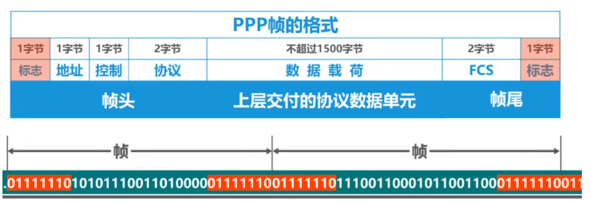

# 三个基本问题

- 封装成帧
- 透明传输
- 差错检测

## 封装成帧

&emsp;&emsp;封装成帧是指：**数据链路层给上层交付的协议数据单元添加帧头和帧尾使之称为帧**。其中，**帧头和帧尾包含了有重要的控制信息**。

&emsp;&emsp;以太网V2的MAC帧(最大长度为1518字节)：

&emsp;&emsp;PPP帧的格式:

&emsp;&emsp;为了使接收方的物理链路层能够正常从发送方的物理层交付的比特流中提取出一个个帧，**帧头帧尾还起到了帧定界的作用**。

&emsp;&emsp;拿PPP帧的格式举例，其**帧头帧尾的左右各一个字节**就起到了帧定界的作用。接收方可以依据帧定界标志的起止从而提取出一个个帧。

&emsp;&emsp;然而**并不是所有的数据链路层协议的帧都包含有帧定界标志**。比如以太网V2的MAC帧。那么接收方该如何从物理层交付的比特流中提取一个个以太网帧呢?

&emsp;&emsp;实际上，以太网的数据链路层将数据单元封装成MAC帧后会将其交付给物理层，**物理层会在MAC帧前面添加8字节的前导码**。前导码中的**前7个字节为前同步码**，作用是使**接收方的时钟同步**；之后的一个字节为**帧开始定界符**，表明其后跟着的为MAC帧。

&emsp;&emsp;除此之外，以太网还规定了帧间间隔发送时间为$96bit$的发送时间，因此MAC帧就不需要帧定界符了。

## 透明传输

&emsp;&emsp;透明传输是指**数据链路层对上层交付的传输数据没有任何限制**，就好像数据链路层不存在一样。

> 个人认为：结合封装成帧的知识点，若传输的比特流数据中恰好存在帧定界符，若没有透明传输，则帧会被错误提取，从而造成数据丢失或损坏。

&emsp;&emsp;由于帧的开始和结束的标志使用专门指明的控制字符，因此所传输的数据中的任何8比特的组合一定不允许和用作帧定界的控制字符的比特编码一样。否则就会出现帧定界的错误。

&emsp;&emsp;但传送的帧是用文本文件组成的帧时，其数据部分显然不会出现像SOH或EOT这样的帧定界控制字符，可见不管从键盘上输入什么字符都可以放在这样的帧中传输过去，因此这样的传输就是透明传输。

&emsp;&emsp;但当数据部分是非ASCII码文本文件时，其数据部分就可能包含帧定界控制字符。数据链路就会错误的将其从完整的帧中截断。此时帧的传输就不是透明传输了，这说明数据链路层对数据有所限制。

&emsp;&emsp;在数据链路层透明传输数据表示**无论什么样的比特组合的数据，都能够按照原样没有差错地通过这个数据链路层**。

&emsp;&emsp;因此，发送的端的数据链路层在数据中出现控制字符"SOH"或"ETO"的前面插入一个转义字符"ESC"。而在接收端的数据链路层在把数据送往网络层之前会删除这个插入的转义字符"ESC"。这种方法称为**字节填充**或**字符填充**。

&emsp;&emsp;**面向字节**的物理链路层我们使用**字节填充**(或字符填充)的方法实现透明传输。而**面向比特**的物理链路层我们则使用**比特填充**的方法实现透明传输。

&emsp;&emsp;首先在发送端，扫描整个信息字段（通常使用硬件方法）。只要发现有5个连续1，就立即填入一个0。这样就保证不会出现6个连续的1。而在接收端，先找到标志字段F以确定一个帧的边界，接着再用硬件对其中的比特流进行扫描，每发现5个连续1时，就把5个连续1后的一个0删除，以还原成原来的信息比特流。这就是利用比特填充实现的透明传输的整个过程。

&emsp;&emsp;**为了提高帧的传输速率，应当使帧的数据部分的长度尽可能的大些**。考虑到差错控制等多种因素，每一种数据链路层协议都规定了帧的数据部分的长度上限，即**最大传送单元MTU**。

## 差错检测

&emsp;&emsp;现实的通信链路都不会是理想的，也就是说，比特在传输过程中可能会产生差错:1变为0,0变为1。这就是**比特差错**或误码。

&emsp;&emsp;**在一段时间内，传输错误的比特占所传输的比特总数的比率称为误码率BER**(Bit Error Rate)。误码率与信噪比有很大的关系。如果可以提高信噪比，那么就可以使误码率减小。为了保证数据传输的可靠性，在计算机网络传输数据时，必须采用各种差错检测措施。在数据链路层中，广泛使用了**循环冗余检验CRC**(Cyclic Redundancy Check)的检错技术。

&emsp;&emsp;**循环冗余校验CRC流程**:

- 收发双方约定好一个**生成多项式$G(x)$**;
- 发送方基于待发送的数据和**生成多项式计算出差错检测码(冗余码)**，并将其添加到待传输的数据的后面一起传输;
- 接收方通过生成多项式来计算收到的数据是否产生了误码；

&emsp;&emsp;举例：

&emsp;&emsp;说明：

小结：

- **检错码**只能检测出帧在传输过程中出现了差错，但并不能定位错误，因此**无法纠正错误**。
- 要想纠正传输中的差错，可以使用冗余信息更多的**纠错码**进行**前向纠错**。但纠错码的开销比较大，在计算机网络中较少使用。
- 循环冗余校验**CRC**有很好的检错能力（**漏检率非常低**），虽然计算比较复杂，但非常**易于用硬件实现**，因此被**广泛应用于数据链路层**。
- 在计算机网络中通常采用**纠错重传方式来纠正传输中的差错，或者仅仅是丢弃检测到差错的帧**，这取决于**数据链路层向其上层提供的是可靠传输服务还是不可靠传输服务**。
