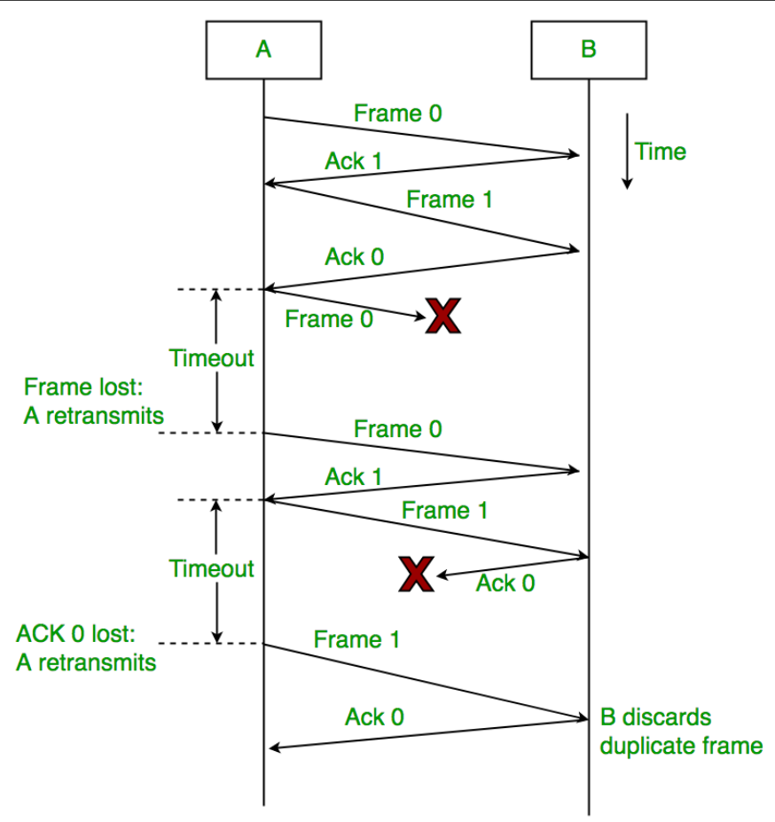

# 可靠传输

## 可靠传输的基本概念

&emsp;&emsp;在介绍完三个基本问题后，我们知道使用**差错检测技术**，接收方的数据链路层就可以检测出帧在传输过程中是否产生了**误码**。而接收方在接收到发送方发送过来的误码后，接下来该怎么办呢?这需要根据**数据链路层向上层提供什么类型的服务**：

- **不可靠传输服务**：数据链路层仅仅丢弃有误码的帧，其它什么也不做；
- **可靠传输服务**：需要想办法实现发送端发送什么，接收端就收到什么。

&emsp;&emsp;一般情况下，**有线链路的误码率比较低**，为了减小开销，并不要求数据链路层向上提供可靠传输服务。即使出现了误码，**可靠传输的问题也将由上层处理**。但是，**无线链路易受干扰**，误码率就比较高，因此要求数据链路层**必须向上层提供可靠传输服务**。

> **比特差错**只是传输差错中的一种，从整个计算机网络体系结构来看，传输差错还包括**分组丢失、分组失序**以及**分组重复**。同时，**可靠传输服务并不局限于数据链路层**，其它各层均可以实现可靠传输服务。

## 可靠传输的实现

&emsp;&emsp;可靠传输的实现机制主要有三种：**停止-等待协议SW、回退N帧协议GBN**以及**选择重传协议SR**。这三种可靠传输的实现机制的基本原理并不局限于数据链路层，而是可以应用到计算机网络体系结构中的各层协议。

### 停止-等待协议SW

&emsp;&emsp;SW协议是数据链路层的几个协议中最基本的协议，是数据链路层各种协议的基础。在通信时，当接收方收到**正确的数据帧**后，便会向发送方发送一个**确认帧$ACK$**,表示发送的数据正确接收。当发送方收到确认帧后才能发送一个新的数据帧；若接收方**接收到的数据产生了误码**，就会丢弃该数据，同时向发送方发送**否认分组$NAK$**，发送方在收到接收方的$NAC$帧后，就会重新发送上一次发送的数据。如此一来就实现了接收方对发送方的流量控制。

&emsp;&emsp;然而在多个网络通过多个路由器互连的情况下，**数据在传输过程中很容易发生丢失**（对于点对点，单信道网络来说，这种情况较少）。若发送方发送的数据在传输过程中发生了**丢失**，接收方**接收不到数据分组**，接收方就**不会发送$ACK$或$NAK$**。若不采取某些策略，发送方就会一直处于**等待**接收方的$ACK$或$NAK$的状态。

&emsp;&emsp;为解决这一问题，可以在发送方发送完一个数据分组时，启动一个**超时计时器**。若发送方的等待时间超过了计时器所设置的**重传时间**，就会重新发送（重传）之前的数据分组。这就是**超时重传**。
> 重传时间一般设定为**从发送方到接收方的平均往返时间**。

&emsp;&emsp;再考虑一种情况，既然发送方的数据分组可能发生丢失，那么接收方发送给发送方的**确认分组$ACK$** 或 **否认分组NAK**，也有可能会发生丢失。若假设接收方发送给发送方的确认分组$ACK$丢失，则必然会导致发送方超时重传，此时接收方**又会再次接收到已接收的数据**。

&emsp;&emsp;为了避免**分组重复**这种传输错误，必须给**每个分组带上序号**。由于发送一个数据分组就停止等待，只要保证每发送一个新的数据分组，其发送序号与上次发送的序号不同即可，因此，只需要用**一个比特来编号**（序号0和序号1）就够了。

&emsp;&emsp;再来考虑一种情况，若接收方成功接收到了发送方发送过来的数据，并向发送方发送$ACK$，然而，$ACK$在传输过程中由于某些原因**造成了延迟**，在规定的**重传时间外**被发送方接收，这种情况下，发送方在接收到$ACK$之前，必然进行了超时重传，向接收方重新发送了原来的数据分组，同时在接收到发生延迟的$ACK$后，又会向接收方发送新的数据分组，接收方再接收到重复的数据分组后，必然会丢弃，同时向发送方发送$ACK$。如此一来，接收方发生了重复确认的情况。

&emsp;&emsp;这种情况的解决策略就是：**对接收方发送过来的确认分组$ACK$或否认分组$NAK$进行编号**。发送方在接收到重复的确认分组$ACK$或否认分组$NAK$时，选择忽略即可。

**小结**

- 接收端检测到数据分组有误码时，将其丢弃并等待发送方的超时重传。但对于误码率较高的点对点链路，为了发送方**尽早重传**，也可**给发送方发送$NAK$分组**。
- 为了使接收方能够判断所收到的数据分组是否重复，需要给**数据分组编号**。由于SW协议的停等特性，**只需要一个比特编号**就够了，即编号0和编号1。
- 为了使发送方能够判断所收到的ACK分组是否重复，需要给**ACK分组编号**，所用比特数量**与数据分组编号所用比特数量一致**。数据链路层一般不会出现ACK分组迟到的情况，因此**在数据链路层实现SW协议可以不用给ACK分组编号**。
- 超时计时器设置的**重传时间**应仔细选择。一般可将重传时间选为**略大于"从发送方到接收方的平均往返时间"**。
  
- 在数据链路层点对点的往返时间比较容易确定，重传时间比较好设定。
- 在运输层，由于端到端往返时间非常不确定，设置合适的重传时间有时并不容易。

&emsp;&emsp;以下是数据链路层的SW协议流程：

### 回退N帧协议GBN

&emsp;&emsp;SW协议为传输提供了控制错误和流量的手段，但这也带来了一个巨大的性能问题：即使发送方有下一个数据包需要发送，它也必须等待来自接收方的确认信息ACK，我们没有在第一个数据包放入链路后用更多数据包填充我们的通信管道。倘若在一个**高带宽、高传播延迟**的通信线路上用SW协议进行数据传输，其**信道利用率将会变得很低**。滑动窗口协议(Sliding Window protocol)通过一次性发送多个具有更大序列号的数据包来解决这一效率问题。这一设计和流水线类似。

&emsp;&emsp;在滑动窗口协议中，当窗口大小为1(即一次性发送1个数据包)时，此时的滑动窗口协议就是SW协议。

&emsp;&emsp;在讨论GBN协议之前，先提一提**累积确认**。累积确认的意思就是：**接收方不必对收到的分组逐个发送确认，而是可以在收到几个分组后，对按序到达的最后一个分组加以确认**。

&emsp;&emsp;假设发送方发送了$0$~$7$个帧，不久后接收到来自接收方$ACK_1$,$ACK_4$两个确认帧，这说明**接收方成功接收到了第0,1帧，第2,3,4帧，而第5,6,7帧没有接收**（超过定时时间，就会认定数据包未被接收）。那么在GBN协议中，发送方就需要对后面第5,6,7帧进行重传，此时N为3，即回退3帧。

&emsp;&emsp;现对GBN协议中的接收方和发送方分别讨论：

#### **发送方**

&emsp;&emsp;现假设发送方有一系列要发送的帧。假设窗口大小为$N$。此外，存在两个指针分别指向待发送帧地址和下一个发送帧的地址。

> 若使用n个比特用来构成分组序号，则窗口N的取值为：
$$
1 < N <= 2^n-1
$$
若N=1，则为SW协议；
若N> $2^n-1$,则接收方无法分辨新旧数据分组

&emsp;&emsp;首先，发送第一个帧。开始时，$send\_base$=$nextseqnum=0$。尽管后序可能会有更多的数据包需要发送，但是$nextseqnum$ < $send$_$base + N$,因此要从$nextseqnum$开始发送，同时根据接收到的确认信息，让$nextseqnum$自增。在整个发送窗口中，会有一个单独的计时器，数据包在$send\_base$发送后进行计时，若发生了超时，发送方将重新启动计时器，同时再次从$send\_base$发送窗口中的数据包。

#### **接收方**

&emsp;&emsp;GBN协议的接收器应该尽可能的简单。接收方的窗口大小只能为1，因此接收方只能按序跟踪下一个接收的连续数据包序列号$nextseqnum$。同时不设有缓冲区，对于无序的数据包或损坏的数据包，将被丢弃。

&emsp;&emsp;在接收到发送方发送过来的数据包后，它都只需要发送最后接收的有序数据包ACK确认信息即可。因此，即使数据传输过程出现了问题，只要没有正确接收到全部数据包，它都会重复接收，直到数据包全部接收完毕。

> 或许从协议的伪代码可以更加了解发送方和接收方的工作原理：

### 选择重传协议SR

&emsp;&emsp;在回退N帧协议中，接收窗口尺寸N只能等于1.因此接收方只能按序接收正确到达的数据分组。同时，一个数据分组的误码就会导致其后续多个数据分组不能被接收方按序接收而丢弃。这必然会造成发送方对这些数据分组的超时重传，显然这是对通信资源的极大浪费。

&emsp;&emsp;为了进一步提高性能，可设法只重传出现误码的数据分组。因此，**接收窗口的尺寸N不应再等于1，而应该大于1**，以便**接收方收下失序到达但无误码并且序号落在接收窗口内的那些数据分组**，等到所缺分组收齐后再一并送交上层。这就是**选择重传协议SR**。

> 选择重传协议为了使发送方仅重传出现差错的分组，接收方不能再采用累积确认，而需要对每个正确接收到的数据分组进行逐一确认。

&emsp;&emsp;由此可以得到SR协议的接收方应该满足以下要求：

- 接收方必须**能够接收乱序**的数据包；
- 由于接收方必须按序将数据包提交给上层，由此接收方必须**设有缓冲区用来缓冲数据包**。

&emsp;&emsp;对于接收方向发送方发送重传请求，有两种方式：

- 隐式：接收方确认每个良好的数据包，在超时之前未确认的数据包会被假定为丢失或错误。必须使用这种方式才能确保接收到每个数据包。
- 显示：接收方可以请求仅重传一个数据包。这种方式可以加快重传，但并不是严格需要的。
- 实现过程中使用一种或两种方法。

> 在传输十分不稳定的情况下，使用显示的SR协议会更好。因为这种情况下，发生重传十分频繁，此时选择性地重传比重传所有帧更有效率。

&emsp;&emsp;在SRP中，接收方的窗口应该小于等于发送方的窗口，若大于发送方的窗口，则无意义（为了提高效率，一般接收双方窗口相等）。为了避免数据包的错误识别，窗口大小的取值应该小于能表示的序列号的一半：

$$
1 < N_r < N_s <= 2^{n-1}
$$

其中n是用来表示序列号的比特数。

