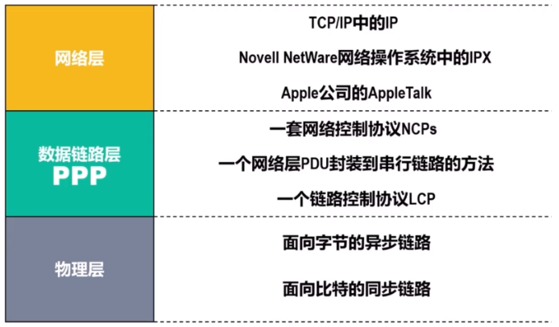
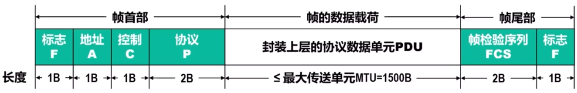
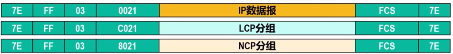
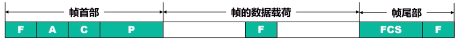
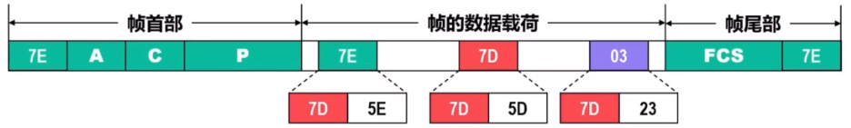
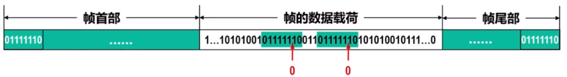

# 点对点PPP协议

&emsp;&emsp;在通信线路质量较差的年代，在数据链路层使用可靠传输协议曾经是一种好办法。因此能实现可靠传输的**高级数据链路控制HDLC**就称为当时比较流行的数据链路层协议。但如今，HDLC已经很少使用了，当前**点对点协议PPP**则是目前使用得最广泛的数据链路层协议。

## 概述

&emsp;&emsp;PPP（点对点）协议是**用户计算机和 ISP 进行通信时所使用的数据链路层协议**。点对点协议为点对点连接上传输多协议数据包提供了一个标准方法。该协议设计的目的主要是用来通过拨号或专线方式建立点对点连接发送数据，使其成为**各种主机、网桥和路由器之间简单连接**的一种解决方案.

## 组成

&emsp;&emsp;PPP协议有三个组成部分：

- 将IP数据报封装到串行链路的方法；
- 用来建立、配置和测试数据链路的**链路控制协议LCP**；
- **一套网络控制协议NCP**，NCPs。

&emsp;&emsp;从网络体系结构的角度看点对点协议的PPP组成如下：

&emsp;&emsp;PPP**既支持异步链路，也支持面向比特的同步链路**。IP数据报在PPP帧中就是其信息部分，这个信息部分的长度受**最大传送单元MTU**的限制。

&emsp;&emsp;在NCPs中，**每一个协议支持不同的网络层协议**，如IP、OSI的网络层、DECnet和AppleTalk等。

## 帧格式(封装成帧)

- **标志(Flag)字段**: PPP帧的定界符，取值为0x7E。
- **地址(Address)字段**: 取值为0xFF,目前没用，用于以后扩展。
- **控制(Control)字段**: 取值为0x03,目前没用，用于以后扩展。
- **协议(Protocol)字段**: 其值用来指明帧的**数据载荷应向上交付给哪个协议处理**。

- **帧检测序列(Frame Check Sequence,FCS)字段**:其值是使用循环冗余校验CRC计算出来的检错码。

## 透明传输

&emsp;&emsp;透明传输主要解决**包含帧定界符的数据包时的数据传输**。如下：

&emsp;&emsp;从不同角度看，标志字段的值会有所不同：
- 从字节角度：取值为0x7E
- 从比特角度：取值为01111110

> 7*16+15 = 127 = $2^{7}$ - 1

### 面向字节的异步链路使用字节填充来实现透明传输

#### **发送方处理**

- 将数据载荷中出现的**每一个0x7E减去0x20**(相当于异或0x20),然后在其前面插入转义字符0x7D;
- 若**数据载荷中原来就含有0x7D**,则把每一个0x7D减去0x20，然后在其前面插入转义字符0x7D;
- 将数据载荷中出现的**每一个ASCII码控制字符加上0x20**,然后在其前面插入转义字符0x7D。

#### **接收方处理**

- 进行**与发送方相反的变换**，就可以正确地恢复出未经过字节填充的原始数据载荷。

### 面向比特的同步链路使用零比特填充来实现透明传输

#### **发送方处理**

&emsp;&emsp;对帧的数据载荷进行扫描，该操作一般由硬件完成。**每出现5个连续的比特1，则在其后填充一个比特0**。

#### **接收方处理**

&emsp;&emsp;对帧的数据载荷进行扫描，**每出现连续的比特1时，就把其后的一个比特0删除**。

## 差错检测

&emsp;&emsp;PPP协议的差错检测是利用帧检验序列FCS进行的。该序列的值是**使用循环冗余校验CRC**计算出的检测码，CRC的生成多项式为：

$$
    CRC - CCITT = X^{16} + X^{12} + X^{5} + 1
$$

&emsp;&emsp;接收方每收到一个PPP帧，就进行CRC检验。若CRC检验正确，就收下这个帧；否则，就丢弃这个帧。需要注意：**使用PPP的数据链路层，向上提供的是不可靠数据传输服务**。