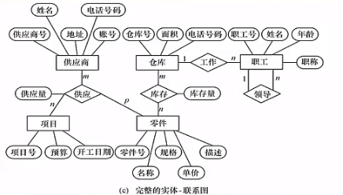
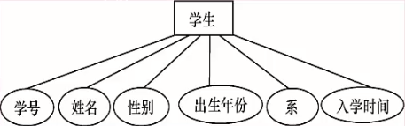
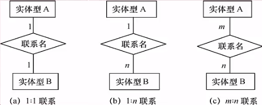
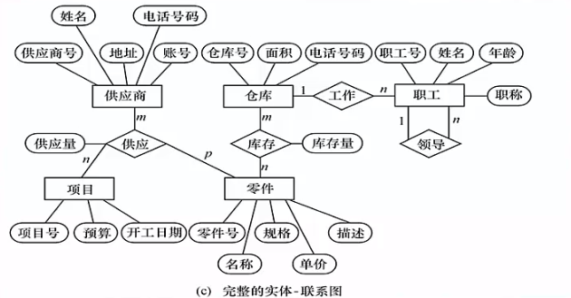
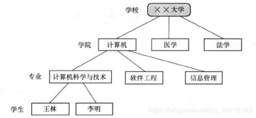
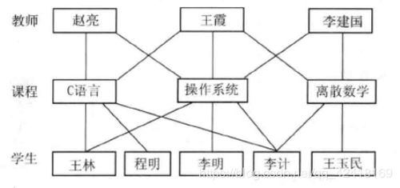
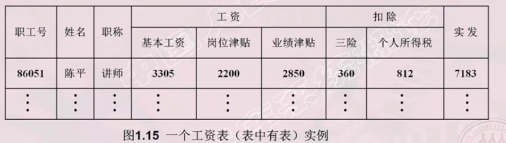

# 数据模型

- 数据模型的概念
- 概念模型
- 逻辑模型和物理模型

## 数据模型的概念

&emsp;&emsp;数据模型是**对现实世界数据特征的抽象**，通俗地讲，数据模型就是**现实世界的模拟**。

&emsp;&emsp;数据模型应满足三方面要求：
- 能比较真实地模拟现实世界；
- 容易为人所理解；
- 便于在计算机上实现；

&emsp;&emsp;数据模型是**数据库系统的核心和基础**。

&emsp;&emsp;数据模型可分为两类：
- **概念模型，也称信息模型**
- **逻辑模型和物理模型**

## 概念模型

&emsp;&emsp;概念模型是按用户地观点来对数据和信息建模，用于数据库设计。其主要用途如下：
- 用于信息世界的建模；
- 是现实世界到机器世界的一个中间层次；
- 是数据库设计的有力工具；
- 数据库设计人员和用户之间进行交流的语言。
  

&emsp;&emsp;一般地，概念模型应该具有：**较强地语义表达能力和简单、清晰、易于用户理解**的基本要求。

1. 信息世界的基本概念
   
   - 实体：**客观存在并可相互区别的事物**。它可以是具体的人、事、物或抽象的概念。如：学生。
   - 属性：**实体所具有的某一特性**。一个实体可以由若干个属性来刻画。如：学号、姓名、性别等。
   - 码：**唯一标识实体的属性集称为码**。如：学号，因为学号可以唯一确认实体。
   - 实体型：**用实体名及其属性名集合来抽象和刻画同类实体称为实体型**。如上图的学生及其一些信息构成了一个学生实体型。
   - 实体集：**同一类型实体的集合**。如：所有的学生，就是学生的实体集。
   - 联系：现实世界中事物内部以及事物之间的联系在信息世界中反映为实体(型)内部的联系和实体(型)之间的联系。
  
     - 实体内部的联系：**组成实体的各属性之间的联系**；
     - 实体之间的联系：**不同实体集之间的联系**

2. 概念模型的表示方法
   
   &emsp;&emsp;概念模型有很多的表示方法，其中一种就是**实体-联系方法**(Entity-Relationship Approach，E-R)。一般用E-R图来描述现实世界的概念模型，而E-R方法也称为E-R模型。

   

## 逻辑模型和物理模型

&emsp;&emsp;逻辑模型主要包括**网状模型、层次模型、关系模型、面向对象数据模型、对象关系数据模型、半结构化数据模型等**。它是按**计算机系统地观点对数据建模，主要用于DBMS实现**。

&emsp;&emsp;物理模型是对数据最底层地抽象。它主要用于**描述数据在系统内(磁盘上)的表示方式和存取方法**。

### 数据模型的组成要素

&emsp;&emsp;数据模型是**严格定义的一组概念的集合**。它精确地描述了系统的静态特性、动态特性和完整性约束条件。因此，数据模型由三部分组成：
- 数据结构 -- 描述系统的静态特性
- 数据操作 -- 描述系统的动态特性
- 完整性约束

1. **数据结构**

&emsp;&emsp;数据结构是刻画数据模型性质的重要方面。一般**使用数据结构的类型来命名数据模型**。如：层次结构-层次模型、网状结构-网状模型、关系结构-关系模型。

&emsp;&emsp;数据结构用于描述数据库的组成对象--对象的类型、内容、性质。

&emsp;&emsp;数据结构用于描述对象之间的联系。

2. **数据操作**

&emsp;&emsp;数据操作就是**对数据库中各种对象的实例允许执行的操作的集合，包括操作及其有关的操作规则**。

&emsp;&emsp;数据操作的类型有：
 - 查询
 - 更新（增、删、改）
  
&emsp;&emsp;数据操作语言：
- 查询语言：QL(Query Language)
- 更新语言：DML

3. **完整性约束条件**

- **是一组完整性规则的集合**
  - 完整性规则：给定的数据模型中数据及其联系所具有的制约和依存规则。
  - 这些规则用以限定符合数据模型的数据库状态以及状态的变化，以保证数据的正确、有效和相容。

- 在数据模型中对完整性约束条件的定义
  - 反映和规定必须遵守的基本的通用的完整性约束条件；
  - 提供定义完整性约束条件的机制，以反映具体应用所涉及的数据必须遵守的特定的语义约束条件。
  
### 层次模型

#### 层次模型的定义

&emsp;&emsp;层次模型用**树形结构**来表示各类实体以及实体间的联系。

&emsp;&emsp;满足下面两个条件的基本层次联系的集合为层次模型：
- 有且只有一个结点没有双亲结点，这个结点称为根结点。
- 根结点以外的其它结点有且只有一个双亲结点。

#### 层次模型的表示
表示方法：

- 实体型： 用记录类型描述。每个结点表示一个记录类型(实体)。
- 属性：用字段描述。每个记录类型可包含若干个字段。
- 联系：用结点之间的连线表示记录类型之间的**一对多的父子联系**。
  

特点：

- 结点的双亲是唯一的；
- 只能直接处理一对多的实体联系
- 任何记录值只有按其路径查看
- 没有一个子女记录值能够脱离双亲记录值而独立存在。
  
#### 层次模型的数据操纵
- 查询
- 插入
- 删除
- 更新

#### 层次模型的完整性约束
- 无相应的双亲结点值就不能插入子女结点值；
- 如果删除双亲结点值，则相应的子女结点值也被同时删除；
- 更新操作时，应更新所有相应记录，以保证数据的移植性。

#### 层次模型的优缺点

- 优点
  - 层次模型的数据结构比较简单清晰
  - 查询效率高，性能优于关系模型，不低于网状模型
  - 层次数据模型提供了良好的完整性支持

- 缺点
  - 结点之间的多对多联系表示不自然
  - 对插入和删除操作的限制多，应用程序的编写比较复杂
  - 查询子女结点必须通过双亲结点
  - 层次数据库的命令趋于程序化

### 网状模型

#### 网状模型的定义
&emsp;&emsp;网状数据库系统采用**网状结构**来表示各类实体以及实体间的联系。
满足下面两个条件的基本层次联系时网状模型：
- 允许一个以上的结点无双亲；
- 一个结点可以有多于一个的双亲。
  
#### 网状模型的表示

表示方法：
- 实体型：用记录类型描述。每个结点表示一个记录类型(实体)。
- 属性：用字段描述。每个记录类型可包含若干个字段。
- 联系：用结点之间的连线表示记录类型之间的**一对多的父子联系**。

特点：
- 允许多个结点没有双亲结点；
- 允许一个结点有多个双亲结点；
- 允许两个结点之间有多种联系；
- 需要为每个联系命名，并指出与该联系有关的双亲记录和子女记录。

#### 网状模型的数据操纵

&emsp;&emsp;网状模型的数据操纵，无论是查询还是增删改，它都是**导航式**的。

#### 网状模型的完整性约束

&emsp;&emsp;网状模型的完整性约束条件是不严格的。
- 允许插入尚未确定双亲结点值得子女结点值；
- 允许只删除双亲结点值。
  
&emsp;&emsp;但实际得网状数据库系统中提供了一定的完整性约束：
- 支持码的概念：唯一标识记录的数据项的集合，取唯一值；
- 保证一个联系中双亲记录与子女记录之间是一对多的联系；
- 可以定义双亲记录和子女记录之间某些约束条件
  
#### 网状数据模型的优缺点

- 优点
  - 能够更好直接地描述现实世界，如一个结点可以有多个双亲；
  - 具有良好地性能，存取效率较高；

- 缺点
  - 结构比较复杂，而且随着应用环境的扩大，数据库的结构就变得越来越复杂，不利于最终用户掌握；
  - DDL、DML语言复杂，用户不容易实现；
  - 记录之间联系是通过存取路径实现的，应用程序必须选择存取路径，加重了程序员的负担。

### 关系模型

#### 关系模型的定义
&emsp;&emsp;关系数据库系统采用**二维表**来表示各类实体以及实体间的联系。

关系模型中相关术语：
- 关系：一个关系对应通常说的一张表；
- 元组：表中的一行即为一个元组；
- 属性：表中的一列即为一个属性，给每个属性起一个名称即为属性名；
- 主码：表中的某个属性组，它可以唯一确定一个元组；
- 域：一组具有相同数据类型的值的集合。属性的取值范围来自某个域；
- 分量：元组中的一个属性值；
- 关系模式：对关系的描述。

#### 关系模型的表示

&emsp;&emsp;关系模型一般使用一张**二维表**来表示，相关术语如下：
|关系术语|表格术语|
|:----:|:-----:|
|关系名|表名|
|关系模式|表头（表格的描述）|
|关系|一张二维表|
|元组|记录或行|
|属性|列|
|属性名|列名|
|属性值|列值|
|分量|一条记录中的一个列值|
|非规范关系|表中有表（大表嵌套小表）|

&emsp;&emsp;关系必须是**规范化**的，其最基本的规范条件：关系的每一个分量必须是一个不可分的数据项，**不允许表中有表**。如下图就是非规范关系的表：

#### 关系模型的数据操纵

&emsp;&emsp;关系模型中的数据操纵是**集合操作**，操作对象和操作结果都是关系。
- 增
- 删
- 改
- 查

#### 关系模型的完整性约束

- 实体完整性
- 参照完整性
- 用户定义的完整性

#### 关系模型的优缺点

- 优点
  - 建立在严格的数学概念的基础上
  - 概念单一
    - 实体和各类联系都用关系来表示
    - 对数据的检索结果也是关系
  - 关系模型的存取路径对用户透明
    - 具有更高的数据独立性，更好的安全保密性
    - 简化了程序员的工作和数据库开发建立的工作

- 缺点
  - 存取路径对用户透明，查询效率往往不如格式化数据模型；
  - 为提高性能，必须对用户的查询请求进行优化，增加了开发数据库管理系统的难度。
