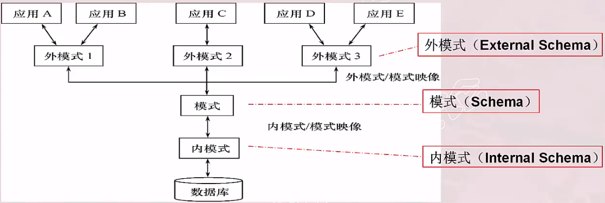
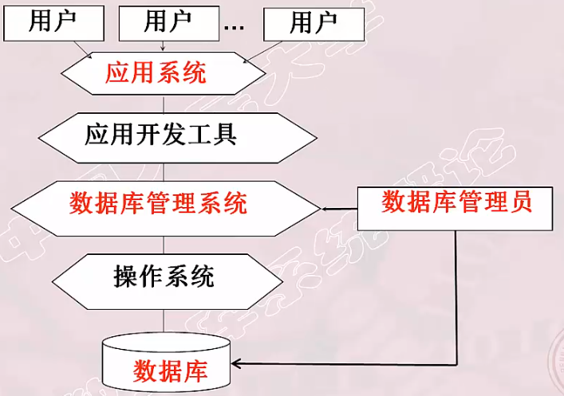
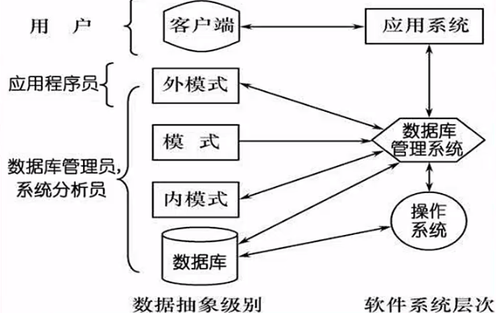

# 数据库系统的结构

- 数据库系统模式的概念
- 数据库系统的三级模式结构
- 数据库的二级映像功能与数据独立性
- 数据库系统的组成

## 数据库系统模式的概念

1. **模式(Schema)**

&emsp;&emsp;模式是对数据库逻辑结构和特征的描述，是一种型的描述，不涉及具体值，并且模式是相对稳定的。

2. **实例(Instance)**

&emsp;&emsp;实例是数据库某一时刻的状态---模式的一个具体值。同一个模式可以有很多实例，并且实例会随着数据库中的数据的更新而变动。

> **一个数据库只有一个模式，可以把模式看成唯一的数据库，实例就是数据库里面的多个表**。

例如：在学生选课数据库模式中，包含学生记录、课程记录和学生选课记录。那么2023年的一个学生数据库实例应包括：
- 2023年学校中所有学生的记录
- 学校开设的所有课程的记录
- 所有学生选课的记录

> 2022年学生数据库模式对应的实例与2003年学生数据库模式对应的实例是不同的。

## 数据库系统的三级模式结构

&emsp;&emsp;数据库系统的三级模式结构包括：**内模式，模式**和**外模式**。

### 模式

&emsp;&emsp;模式是**数据库中全体数据的逻辑结构和特征的描述，是所有用户的公共数据视图**。一般的，某个应用的数据库有一个模式。

&emsp;&emsp;模式是数据库系统模式结构的中心，它与数据的物理存储细节和硬件环境无关，与具体的应用程序、开发工具以及高级程序设计语言无关。

&emsp;&emsp;定义模式时不仅要定义数据的逻辑结构，还要定义数据之间的联系以及与数据有关的安全性、完整性要求。

### 外模式

&emsp;&emsp;外模式是**数据库用户使用的局部数据的逻辑结构和特征描述，是数据库用户的数据视图，是与某一应用有关的数据的逻辑表示**。

> 外模式与模式的关系：
> - 外模式通常是**模式的子集**、一个模式可以有多个外模式；
> - 对模式中某一数据，在不同的外模式中结构、类型、长度、保密级别等都可以不同。

&emsp;&emsp;**一个外模式可以为多个应用系统所使用，一个应用程序只能使用一个外模式**。外模式的用途有：
- 每个用户只能看见和访问所对应的外模式中的数据，简化用户视图；
- 是保证数据库安全性的一个有力措施。

### 内模式

&emsp;&emsp;内模式是**数据物理结构和存储方式的描述，是数据在数据库内部的表示方式**，例如：记录的存储方式(顺序存储、hash存储等)、索引的组织方式(B+树、hash等)、数据是否压缩存储、数据是否加密等。**一个数据库只有一个内模式**。

## 数据库的二级映像功能与数据独立性

&emsp;&emsp;三级模式是**对数据的三个抽象级别**。数据库管理系统内部提供二级映像：**外模式/模式映像、模式/内模式映像**。二级映像功能是**为了三个抽象层次的联系和转换**。

### 外模式/模式映像

&emsp;&emsp;对于每个外模式，都有一个外模式/模式映像。它定义外模式与模式之间的对应关系，映像定义通常**包含在各个外模式的描述中**。

&emsp;&emsp;外模式/模式映像**保证了数据的逻辑独立性**。因为当模式改变时，数据库管理员可以对该映像作相应的改变，使外模式保持不变，同时应用程序是依据数据的外模式编写的，应用程序不必修改，保证了数据与程序的逻辑独立性。 

### 模式/内模式映像

&emsp;&emsp;模式/内模式映像**定义了数据全局逻辑结构与存储结构之间的对应关系**。即逻辑记录对应何种存储结构。**数据库中模式/内模式映像是唯一的，该映像的定义通常包含在模式描述中**。

&emsp;&emsp;模式/内模式映像**保证了数据的物理独立性**。因为当数据库的存储结构改变了，数据库管理员只需修改模式/内模式映像，使模式保持不变。当模式不变时,外模式/模式映像又可以保证应用程序不变，从而保证了数据与程序的物理独立性。 

### 小结

&emsp;&emsp;二级映像功能**保证了数据与程序之间的独立性**，这种独立性具有如下好处：
- 保证了应用程序的稳定性
- 从过去以程序为中心发展为以数据为中心
- 数据的存取由数据库管理系统管理

## 数据库系统的组成

&emsp;&emsp;数据库系统由数据库、数据库管理系统及其开发工具、应用程序以及数据库管理员组成。

### 硬件平台及数据库

&emsp;&emsp;数据库系统对硬件资源要求：**具有足够大的内存、足够大的磁盘或磁盘阵列等外部设备、较高的通道能力，提高数据传送率**。

### 软件

&emsp;&emsp;数据库系统的软件主要包括以下：
- 数据库管理系统
- 支持数据库管理系统运行的操作系统
- 与数据库接口的高级语言及其编译系统
- 以数据库管理系统为核心的应用开发工具
- 为特定应用环境开发的数据库应用系统

### 人员

数据库系统中人员的组成主要包括：
- 数据库管理员
  - **决定数据库中的信息内容和结构；**
  - **决定数据库的存储结构和存取结构；**
  - **定义数据的安全性要求和完整性约束条件；**
  - **监控数据库的使用和运行；**
  - **数据库的改进和重组、重构。**
- 系统分析员和数据库设计人员
- 应用程序员
- 最终用户

&emsp;&emsp;**不同的人员涉及不同的数据抽象级别，具有不同的数据视图**。

