# 关系操纵

- 关系数据语言的分类
- 传统关系操作
- 关系特有操作

## 关系数据语言的分类

### **关系代数语言**

&emsp;&emsp;关系代数语言是用**关系的运算来表达查询要求**的。如：ISBL。

### **关系演算语言**

&emsp;&emsp;关系演算语言可分为以下两类：
- 元组关系演算语言(ALPHA、QUEL)
- 域关系演算语言(QBE)

### **具有关系代数和关系演算双重特点的语言**

&emsp;&emsp;具有关系代数和关系演算双重特点的语言又称为**结构化查询语言(Structured Query Language,SQL)**。SQL是**集查询、数据定义语言、数据操纵语言和数据控制语言于一体的关系数据语言**。特别的，SQL是**一种高度非过程化的语言**。

## 关系代数

&emsp;&emsp;关系代数是一种抽象的查询语言，它用对关系的运算来表达查询。在关系代数中，运算对象是关系，运算结果也是关系，关系代数的运算符有两类：集合运算符和专门的关系运算符。

> 集合运算符

|运算符|含义|
|:----:|:----:|
|$\cup$|并|
|-|差|
|$\cap$|交|
|$\times$|笛卡尔积|

> 专门的关系运算符

|运算符|含义|
|:---:|:----:|
|$\sigma$|选择|
|$\pi$|投影|
|$\Join$|连接|
|$\div$|除|

## **基本符号**

(1) **$R,t \in R,t[A_i]$**

&emsp;&emsp;设关系模式为$R(A_1,A_2,...,A_n)$,它的一个关系为$R$,则：
- $t \in R$表示$t$是$R$的一个元组；
- $t[A_i]$表示元组$t$中相应于属性$A_i$的一个分量。

(2) **$A,t[A],\overline{A}$**

&emsp;&emsp;若$A=\{A_{i1},A_{i2},...,A_{ik}\}$,其中$A_{i1},A_{i2},...,A_{ik}$是$A_1,A_2,...,A_n$中的一部分，则$A$称为**属性列**或**属性组**。

&emsp;&emsp;$t[A] = (t[A_{i1}],t[A_{i2}],...,t[A_{Aik}])$表示元组$t$在属性列$A$上诸分量的集合。

&emsp;&emsp;$\overline{A}$则表示${A_1,A_2,...,A_n}$中去掉$A_{i1},A_{i2},...,A_{ik}$后剩余的属性组。

(3) **$\mathop{\frown} \limits_{t_rt_s}$**

&emsp;&emsp;$R$为$n$目关系，$S$为$m$目关系，其中$t_r\in R$,$t_s \in S$,则$\mathop{\frown} \limits_{t_rt_s}$称为元组的连接。

&emsp;&emsp;$\mathop{\frown} \limits_{t_rt_s}$是一个$n+m$列的元组，前$n$个分量为$R$中的一个$n$元组，后$m$个分量为$S$中的一个$m$元组。

(4) **象集$Z_x$**

&emsp;&emsp;给定一个关系$R(X,Z)$,$X$和$Z$为属性组。则当$t[X] = x$时，$x$在$R$中的象集为：
$$
    Z_x = \lbrace t[Z] | t\in R,t[X] = x \rbrace
$$

&emsp;&emsp;它表示$R$中属性组$X$上值为$x$的诸元组在$Z$上分量的集合。

## 传统关系操作

### **并运算**

&emsp;&emsp;现给定$R$和$S$,他们**都具有相同的目$n$，即两个关系都有$n$个属性，相应的属性取自同一个域**。

&emsp;&emsp;$R \cup S$。结果仍为$n$目关系，由属于$R$或属于$S$的元组组成：
$$
    R \cup S = \lbrace t | t \in R \lor t \in S \rbrace
$$

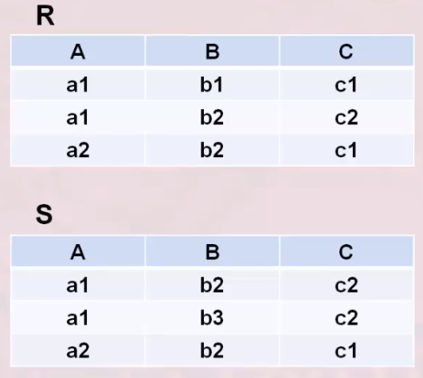

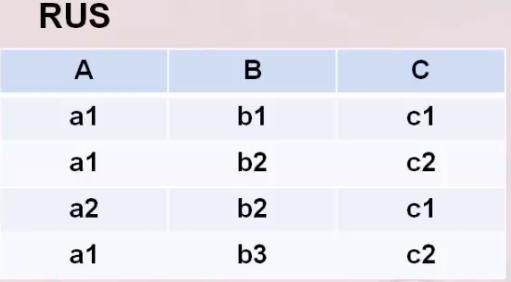

### **差运算**

&emsp;&emsp;现给定$R$和$S$,他们**都具有相同的目$n$，即两个关系都有$n$个属性，相应的属性取自同一个域**。

&emsp;&emsp;$R - S$。结果仍为$n$目关系，由属于$R$而不属于$S$的所有元组组成：
$$
    R - S = \lbrace t | t\in R \land t \notin S \rbrace
$$

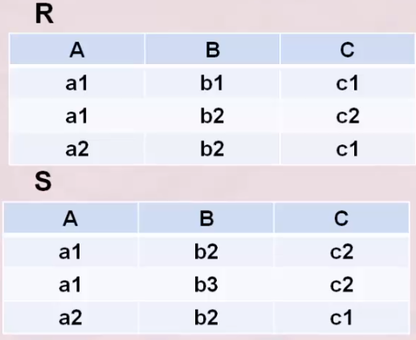

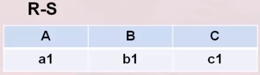

### **交运算**

&emsp;&emsp;现给定$R$和$S$,他们**都具有相同的目$n$，即两个关系都有$n$个属性，相应的属性取自同一个域**。

&emsp;&emsp;$R \cap S$。结果仍为$n$目关系，由既属于$R$又属于$S$的元组组成：
$$
    R \cap S = \lbrace t | t \in R \land t \in S \rbrace
$$

$$
    R \cap S = R - (R - S)
$$

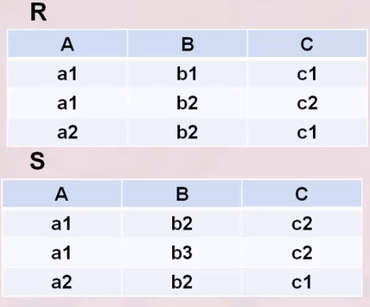

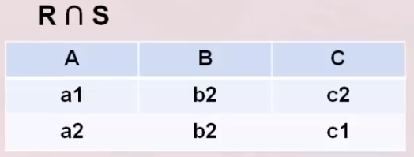

### **笛卡尔积**

&emsp;&emsp;给定具有$n$目关系，$k_1$个元组的$R$和具有$m$目关系,$k_2$个元组的$S$。

&emsp;&emsp;$R \times S$:

- 列：(n + m)列元组的集合。元组的前$n$列是关系$R$的一个元组，后$m$列是关系$S$的一个元组。
- 行：$k_1 \times k_2$个元组：

$$
R \times S = \lbrace \mathop{\frown} \limits_{t_rt_s} | t_r \in R \land t_s \in S  \rbrace
$$

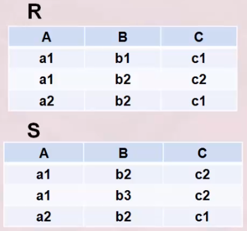

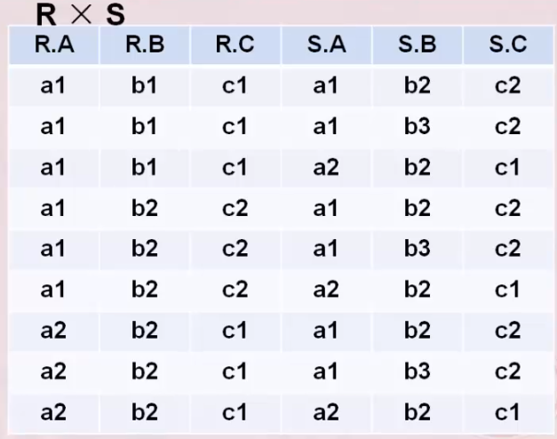

## 专门的关系运算

### **选择**

&emsp;&emsp;选择又称为限制。它是在关系$R$中选择满足给定条件的诸元组，记作：
$$
    \sigma_F(R) = \lbrace t | t \in R \land F(t) = true \rbrace
$$

&emsp;&emsp;其中$F$表示选择条件，它是一个逻辑表达式，取$true$或$false$。该逻辑表达式$F$的基本形式为：

$$
    X_1 \varTheta Y_1
$$

&emsp;&emsp;其中，${\varTheta}$表示比较运算符，可以是$>,\ge,<,\le,=或<>(\ne)$。

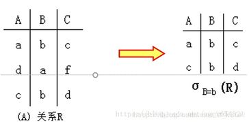

### **投影**

&emsp;&emsp;关系$R$上的投影是从$R$中选择出若干属性列组成新的关系。记作：
$$
    {\prod}_A(R) = \lbrace t[A] | t \in R \rbrace
$$

&emsp;&emsp;其中，$A$为R中的属性列。

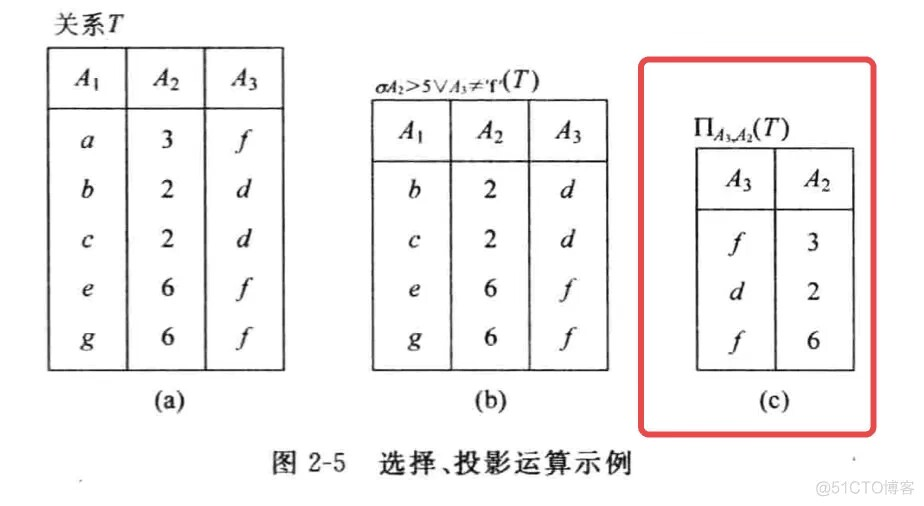

### **连接**

&emsp;&emsp;连接也称为$\varTheta$连接。它是从两个关系的笛卡尔积中选取属性间满足一定条件的元组。记作：
$$
    R \mathop{\bowtie} \limits_{A \varTheta B} S = \lbrace \mathop{\frown} \limits_{t_rt_s} | t_r \in R \land t_s \in S \land t_r[A] \varTheta t_s[B] \rbrace
$$

&emsp;&emsp;其中，$A$和$B$分别为$R$和$S$上列数相等且可比的属性组，$\varTheta$是比较运算符。

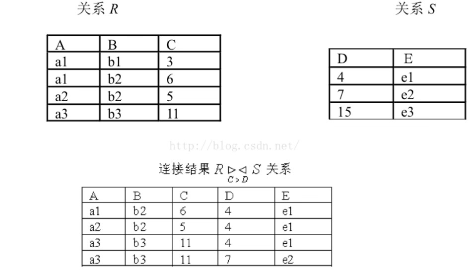

#### 等值连接

&emsp;&emsp;若$\varTheta$为"$=$"的连接运算称为等值连接。此时就是从关系$R$和关系$S$的广义笛卡尔积中选取$A、B$属性值相等的元组集，表示方法为：

$$
    R \mathop{\bowtie} \limits_{A = B} S = \lbrace \mathop{\frown} \limits_{t_rt_s} | t_r \in R \land t_s \in S \land t_r[A] = t_s[B] \rbrace
$$

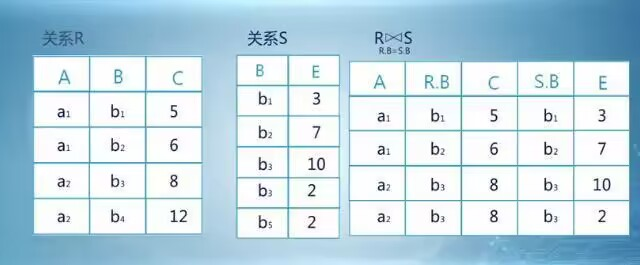

#### 自然连接

&emsp;&emsp;自然连接是一种特殊的等值连接。它要求：**两个关系中进行比较的分量必须是相同的属性组**，同时**在结果中把重复的属性列去掉**。

&emsp;&emsp;由此可以知晓，$R$和$S$具有相同的属性组$B$,其表示方式为：

$$
    R \mathop{\bowtie}  S = \lbrace \mathop{\frown} \limits_{t_rt_s}[U-B] | t_r \in R \land t_s \in S \land t_r[B] = t_s[B] \rbrace
$$

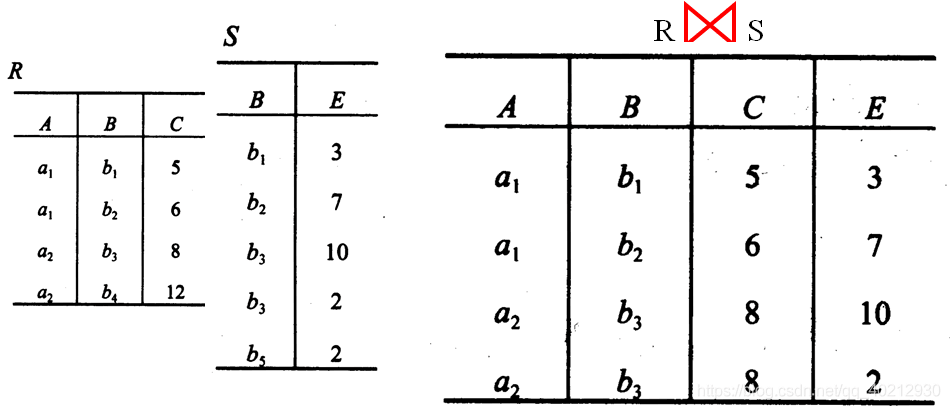

### **除运算**

&emsp;&emsp;设关系$R$除以关系$S$的结果为关系$T$,**则$T$包含所有在$R$但不在$S$中的属性及其值，且$T$的元组与$S$的元组的所有组合都在$R$中**。

&emsp;&emsp;给定关系$R(X,Y)$和$S(Y,Z)$,其中$X,Y,Z$为属性组。$R$中的$Y$与$S$中$Y$可以有不同的属性名，但都出自同一域集。$R$与$S$的除运算得到一个新的关系$P(X)$,$P$是$R$中满足下列条件的元组在$X$属性列上的投影：**元组在$X$上分量值为$x$的象集$Y_x$包含$S$在$Y$上投影的集合**。表示为：

$$
    R \div S = \lbrace t_r[X] | t_r \in R \land \varPi_Y(S) \subseteq Y_x \rbrace
$$

&emsp;&emsp;其中$Y_x$为$x$在$R$中的象集，$x=t_r[X]$

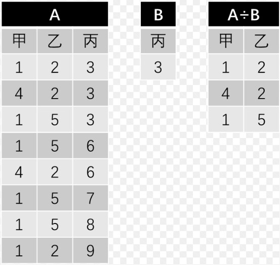

### 小结

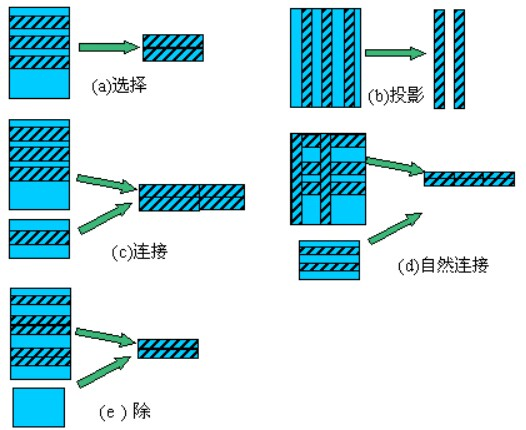